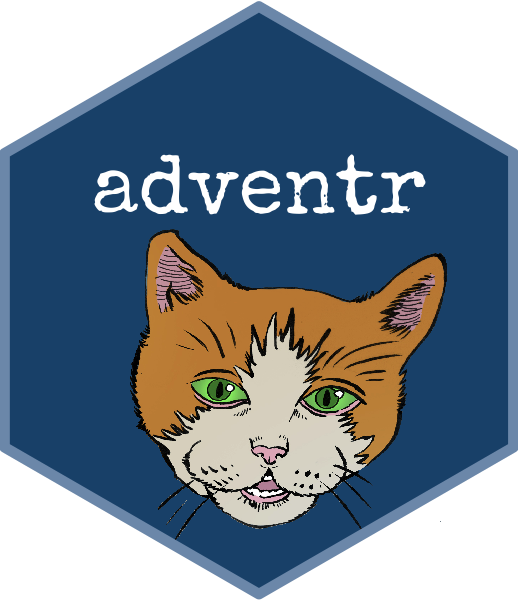
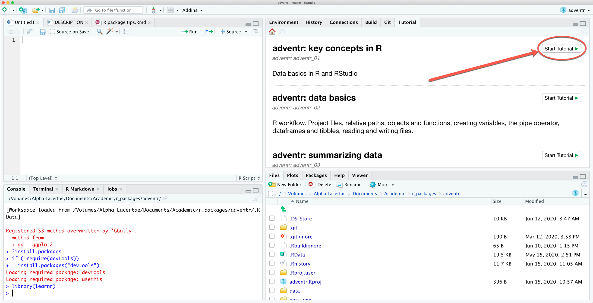

<div style="float: right"></div>

# adventr: R tutorials for An Adventure in Statistics (Field, 2016)

The `adventr` package contains a series of interactive tutorials that teach  alongside chapters of my 2016 textbook [An Adventure in Statistics: the reality enigma](https://www.discoveringstatistics.com/books/an-adventure-in-statistics/). The tutorials are written using a package called [learnr](https://rstudio.github.io/learnr/). Once a tutorial is running it's a bit like reading a book but with places where you can practice the R code that you have just been taught. The `adventr` package is free (as are all things -related) and offered to support tutors and students using my textbook who want to learn R.

# Installation

You can install the latest release of `adventr` from CRAN in the usual way. Note that you should include `dependencies = TRUE` to also install the packages used in the tutorials on your system. If you omit this argument, you will need to manually install these packages (which you won't want to do, trust me).

```
install.packages("adventr", dependencies = TRUE)
```

If you want the very latest development version, you can install it from GitHub by executing (in **RStudio**):

```
if(!require(devtools)){
  install.packages("devtools")
}

devtools::install_github("profandyfield/adventr", dependencies = TRUE)
```

# Contents of `adventr`

The package was written initially to support my own teaching on a module where I base the content around [An Adventure in Statistics](https://www.discoveringstatistics.com/books/an-adventure-in-statistics/). One quirk of this is that there are some advanced tutorials on topics not covered in the book (but continue the themes of the book ...). Another quirk is that - at present - there are some chapters that don't have associated tutorials (for example, the Chapter on probability).

The tutorials are named to correspond (roughly) to the relevant chapter of the book. For example, *adventr_03* would be a good tutorial to run alongside teaching related to chapter 3, and so on.

* **adventr_02**: R workflow. Project files, relative paths, objects and functions, creating variables, the pipe operator, dataframes and tibbles, reading and writing files.
* **adventr_03**: Summarizing data, introducing ggplot2, histograms, editing plots, frequency polygons.
* **adventr_04**: Fitting models. The mean, median, outliers, sums of squares and variance.
* **adventr_05**: Visualizing data. Summarizing data by group, plotting grouped data, boxplots, plotting means, plotting raw data, scatterplots.
* **adventr_08**: Inferential and robust statistics. Confidence intervals, plotting confidence intervals, robust means, robust confidence intervals, bootstrapping. (covers Chapter 9 too.)
* **adventr_11**: Hypothesis testing, effect sizes and Bayes factors.
* **adventr_14**: The general linear model (GLM). Fittinga nd interpreting models with one and two predictors, model diagnostics, robust models, Bayes factors.
* **adventr_15**: Categorical predictors in the GLM (comparing two means). The t-test, linear models with a two-category predictor, robust estimates, Bayes factors, other robust approaches (trimmed means).
* **adventr_15_rm**: Comparing two related/dependent means. The t-test, multilevel linear models with a two-category predictor, robust estimates, Bayes factors, other robust approaches (trimmed means).
* **adventr_16**: Categorical predictors in the GLM (comparing several means). Linear models with a multi-category predictor, contrast coding, robust estimates, Bayes factors, other robust approaches (trimmed means).
* **adventr_16_rm**: Comparing several related/dependent means. Multilevel linear models with a multi-category predictor, contrast coding, robust estimates, Bayes factors.
* **adventr_17**: Factorial designs. Linear models with several categorical predictors, contrast coding, interactions, robust estimates, Bayes factors, other robust approaches (trimmed means).
* **adventr_mlm**: Fitting multilevel models. Fixed vs random slopes, preparing categorical predictors, fitting and interpreting the models. (not covered in the book)
* **adventr_growth**: Modelling change over time. Growth models using multilevel modelling. (not covered in the book)
* **adventr_log**: Categorical outcomes. Crosstabulating frequency data, odds ratios, logistic regression, robust logistic regression. (not covered in the book)

# Running tutorials

In  Version 1.3 onwards there is a tutorial pane. Having executed

```
library(adventr)
```

A list of tutorials appears in this pane. Scroll through them and click on the  button to run the tutorial:




Alternatively, to run a particular tutorial from the console execute:

```
library(adventr)
learnr::run_tutorial("name_of_tutorial", package = "adventr")
```

and replace "name of tutorial" with the name of the tutorial you want to run. For example, to run tutorial 3 (for Chapter 3) execute:

```
learnr::run_tutorial("adventr_03", package = "adventr")
```

The name of each tutorial is in bold in the list above. Once the command to run the tutorial is executed it will spring to life in a web browser.

# Suggested workflow

The tutorials are self-contained (you practice code in code boxes) so you don't need to use  at the same time. However, to get the most from them I would recommend that you create an  project and within that open (and save) a new RMarkdown file each time to work through a tutorial. Within that Markdown file, replicate parts of the code from the tutorial (in code chunks) and use Markdown to write notes about what you have done, and to reflect on things that you have struggled with, or note useful tips to help you remember things. Basically, write a learning journal. This workflow has the advantage of not just teaching you the code that you need to do certain things, but also provides practice in using  itself.

See this video explaining my suggested workflow:

<iframe width="560" height="315" src="https://www.youtube.com/embed/FhoYCsZttGc" frameborder="0" allow="accelerometer; autoplay; clipboard-write; encrypted-media; gyroscope; picture-in-picture" allowfullscreen></iframe>
