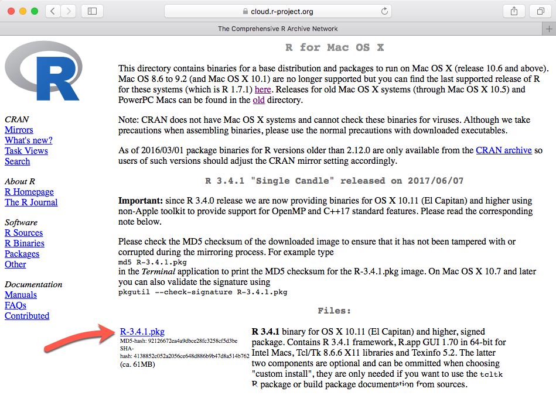
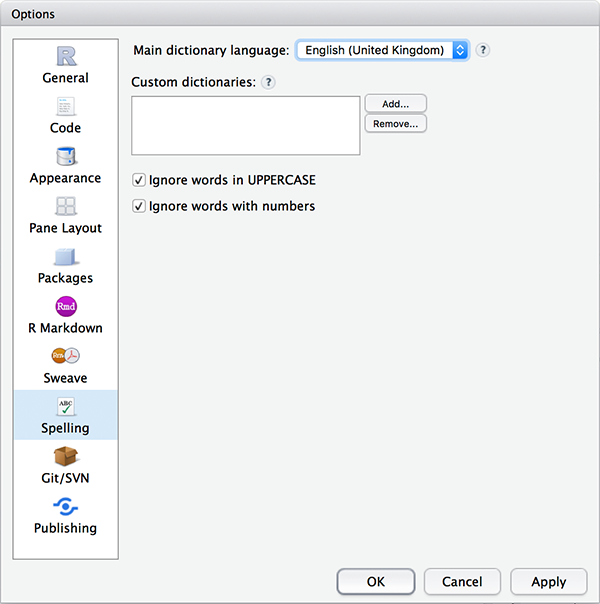

```{r setup, include=FALSE}
knitr::opts_chunk$set(echo = FALSE)
library(learnr)

hint_text <- function(text, text_color = "#E69F00"){
  hint <- paste("<font color='", text_color, "'>", text, "</font>", sep = "")
  return(hint)
}
```

# adventr: Key Concepts in R**

## Overview

This tutorial is one of a series that accompanies [An Adventure in Statistics](https://www.discoveringstatistics.com/books/an-adventure-in-statistics/) [@RN10163] by me, [Andy Field](https://en.wikipedia.org/wiki/Andy_Field_(academic)). These tutorials contain abridged sections from the book so there are some copyright considerations but I offer them under a [Creative Commons Attribution-NonCommercial-NoDerivatives 4.0 International License](http://creativecommons.org/licenses/by-nc-nd/4.0/), ^[Basically you can use this tutorial for teaching and non-profit activities but do not meddle with it or claim it as your own work.]

* Who is the tutorial aimed at?
    - Anyone teaching from or reading [An Adventure in Statistics](https://www.discoveringstatistics.com/books/an-adventure-in-statistics/)  may find them useful.
* What is covered?
    - This tutorial looks at some key concepts in using **R** and **RStudio**. It would be a useful tutorial to run at the start of a module, or alongside teaching based on Chapter 1 of [An Adventure in Statistics](https://www.discoveringstatistics.com/books/an-adventure-in-statistics/).
    - This tutorial *does not* teach the background theory: it is assumed you have either attended my lecture or read the relevant chapter in the aforementioned books (or someone else's)


## The relationship between R and RStudio

Having installed R, the best advice is to forget about it because once you launch RStudio it finds whatever version of R you have installed, negating the need for you to ever witness the horrors of the native R interface. By all means launch the native R app if you want to, but don’t expect me to treat the ensuing trauma.

## Packages and the CRAN
R exists as a base package with a reasonable amount of functionality. However, its beauty is that it can be expanded by downloading packages that add specific functionality to the base software. These packages, as well as the software itself, are stored in a central location known as the CRAN (Comprehensive R Archive Network). Once a package is stored in the CRAN, anyone with an internet connection can download it from the CRAN and install it to use within their own copy of R. The CRAN is central to using R: it is the place from where you download the software and any packages that you want to install. It would be a shame, therefore, if the CRAN were one day to explode or be eaten by cyber-lizards. The statistical world might collapse. Even assuming the cyber-lizards don’t rise up and overthrow the Internet, it is still a busy place. Therefore, rather than have a single CRAN location that everyone accesses, the CRAN is ‘mirrored’ at different places across the globe. ‘Mirrored’ means that there are identical versions of the CRAN scattered across the world. In general, access a mirror of the CRAN close to you. Figure 1.5 shows schematically what we have just learnt. At the centre of the diagram is the CRAN: a repository of the base R software and thousands of packages. People with big brains from all over the world write new packages and upload them into the CRAN for others to use. The CRAN itself is mirrored at different places across the globe (which means there are multiple copies of it). As a user of R, you download the software and install any packages that you want to use via your nearest CRAN.


 
We’ll look at installing and loading packages in due course.

```{r cran_quiz}
learnr::quiz(
  learnr::question("What is the CRAN?",
    learnr::answer("A repository from which you download **R** and install packages", correct = TRUE),
    learnr::answer("The part of **R** that processes commands"),
    learnr::answer("The place from where you download **RStudio**"),
    learnr::answer("The institutions where people develop packages for **R**"),
    correct = "Correct - well done!",
    incorrect = "Sorry, that's incorrect. Try again.",
    random_answer_order = TRUE,
    allow_retry = T
  ),
  learnr::question("What is a package?",
    learnr::answer("A bunch of code that when installed and loaded into **R** provides additional functionality", correct = TRUE),
    learnr::answer("An exact copy of the CRAN at a specific location on the planet", message = "This answer describes a 'mirror'."),
    learnr::answer("A repository from which you download **R** and install packages", message = "This answer describes the CRAN"),
    correct = "Correct - well done!",
    random_answer_order = TRUE,
    allow_retry = T
  )
)

```

## Functions and objects

To communicate with R you type commands that tell it what to do. This process might seem strange to you because you are probably used to interacting with software by using your mouse to click on options and on-screen buttons. The problem with poiting and clicking is that the process isn't reproducible (unless you note down your every movement and click). Often when analysing data we want to reproduce what we have done, by typing commands, and saving those commands, we are able to reproduce the exact steps that we previously took when analysing the data.

The conversation that you have with R consists of you typing instructions, then doing something to execute those instructions. R will either dutifully carry out your instructions or complain that your instructions weren’t clear enough or asked it to do something that it couldn’t do. In short, you type commands, try to execute them and R either does it or throws an error. In the early days of learning R you will become very familiar with error messages, they are typically indecipherable so fear not if they seem like gibberish. 

A simple ‘conversation’ with R is made up of commands that follow the common structure shown in Figure 2:

```
object <- instructions
```

Which you can read as object is created from instructions. In the middle of each command is an arrow (`<-`) known as the **assignment operator**, so called because it assigns the stuff on the right of the command to the thing on the left (hence the arrow points right-to-left). The ‘thing’ on the left is an **object** that is created when the command is executed. An object could be a variable, a table of data, a collection of variables, a statistical model, output from a statistical model, a plot or anything that R can create. An object can be a single value (e.g., a median of a set of scores) or collections of information (e.g. the details of a statistical model). The ‘stuff’ on the right, which I’ve called instructions, are typically a set of operations or the results of applying a function.


For example, the first command in Figure 2:

```
metallica <- c("Lars","James","Jason", "Kirk")
```

creates an object called *metallica*, consisting of the four band members’ first names (pre 2001). The ‘instructions’ used to create the object *metallica* include the concatenate function, `c()`, which collects things together. A function is a bit of code that someone has written (and that you can write yourself) that typically has at least one argument and an output. **Functions** have a name followed by parenthesis, for example, `ggplot()`, `mean()` and `plot()`. **Arguments** are inputs to the function, which are pre-defined things that you specify within the parentheses. You can think of them like options that you set for the function. These ‘options’ can do things like specify the data on which the function operates, specify a model that you want to fit, or determining how the function behaves, for example, what it does when it encounters missing values in the data.  Most functions return an output, which could be a new data set, a value, information about a statistical model, a graph and so on.
 
In the first command in Figure 2 the arguments passed into the `c()` function are the band member’s names as four separate strings of text, and the output returned by the function is these strings collected together as a single entity. So, we input each band member’s name (in straight quotes and separated by commas), and by enclosing them in `c()` we bind them into a single entity, which is assigned (using <-) to an object that we have called ‘metallica’. Once this command is executed the object that we called ‘metallica’ is created and stored in memory so we can use it in future commands.

`r hint_text("Tip: Simultaneously press the **alt** + **−** keys to insert the assignment operator (<-)") `

Let's try this out. In the code box below type `metallica <- c("Lars","James","Jason", "Kirk")` and then click .

```{r met_data, exercise=TRUE}

```

```{r met_data-solution}
metallica <- c("Lars","James","Jason", "Kirk")
```

You should find that nothing happened, which will be disconcerting. That's because we told R to create the object *metallica* but not to show it to us. So, the object *metallica* has been created and stored in R’s memory and we can refer back to it, use it to do other things, change it, and view it. To view it we execute its name. So, let's try the exercise above but now ask to see the object *metallica* that we have created by executing:

```
metallica <- c("Lars","James","Jason", "Kirk")
metallica
```

```{r met_data_2, exercise=TRUE}

```

```{r met_data_2-solution}
metallica <- c("Lars","James","Jason", "Kirk")
metallica
```

Notice that the contents of the object *metallica* are displayed:

```{r}
metallica <- c("Lars","James","Jason", "Kirk")
metallica
```

We can do other things with our newly created object too, but we'll save that fun for another time.

```{r funs_quiz}
learnr::quiz(
  learnr::question("What is a function in R?",
    learnr::answer("An instruction that typically creates an output from at least one input", correct = TRUE),
    learnr::answer("A lady who loves to boogie to Parliament and Funkadelic", message = "No, that's a funk Sian."),
    learnr::answer("Something created by R", message = "No, that's an object."),
    learnr::answer("The weird arrow thing", message = "No, that's the assignment operator (<-)."),
    correct = "Correct - well done!",
    random_answer_order = TRUE,
    allow_retry = T
  ),
  learnr::question("What is an argument in R?",
    learnr::answer("An option that can be set within a function that controls what it does", correct = TRUE),
    learnr::answer("When you tell R to do something and it throws an error message", message = "No, that's your life for the next few years."),
    learnr::answer("An instruction that typically creates an output from at least one input", message = "No, that's a function"),
    learnr::answer("The weird arrow thing", message = "No, that's the assignment operator (<-)."),
    correct = "Correct - well done!",
    random_answer_order = TRUE,
    allow_retry = T
  )
)

```


### Optional: still confused about functions and arguments then read on

If the idea of functions and arguments seem confusing, try to think of a function as activating a dialog box and arguments as setting options within that dialog box. To see what I mean, let’s take a simple function `mean()`, which (no surprises here) calculates the mean (or average) of a set of scores. This function takes the general form:

`mean(variable_name, na.rm = FALSE, trim = 0)`

The function takes three arguments:

*	`variable_name` is the name of the variable for which you want to compute a mean. In other words, you name the object containing the scores of which you want the mean
* `na.rm = FALSE` is an argument that sets whether to remove missing values (TRUE) or not (FALSE)
*	`Trim = 0` is an argument that determines by how much you trim the scores before computing the mean. The default is 0 (include all scores) but you can set another value, such as 5 (trim 5% of scores from both extremes of the scores before computing the mean).

Don't worry too much about understanding what the arguments do for now, we'll come back to this function in a later tutorial. Figure 3 maps this process of setting arguments within functions to ticking check boxes in a dialog box. In this imaginary statistics software, we have selected a menu called ‘mean’ that opens the dialog box in the figure. This action is comparable to typing `mean()`: it activates the function, but if we were to click *OK* nothing would happen because we haven’t told the computer which variable to compute the mean on. Put another way, without setting any arguments, the function doesn’t do anything. Our imaginary dialog box has three ‘arguments’ or ‘things you can do’. The first is to drag a variable from a list of variables to a space, in doing so you select the variable to analyse. In the diagram I’ve chosen to analyse a variable called **songs_written.** Having selected the variable, two options are available: the first determines what we do with missing values, and the second determines how much we trim the scores. Each option or ‘argument’ has a tick box. Having specified a variable, we could click on *OK* and we’d get some output because the options/arguments have default values (Figure 3 left): the tick box for removing missing values is unchecked, which is the same as typing `na.rm = FALSE` into the function, and the checkbox for trimming the mean is unchecked which is the same as typing `trim = 0` into the function. In other words it would be like executing:

`mean(songs_written)`

We don’t need to write `na.rm = FALSE, trim = 0` explicitly within the function because these are the defaults values that the function will use. However, we could change these defaults by changing these arguments. Going back to our imaginary dialog box, the right side of Figure 3 shows that same variable is selected (**songs_written**), but this time the user has selected the option for removing missing values, which equates to typing `na.rm = TRUE` into the function. The user has also selected to trim means and type in a value of 5 to set the amount of trim, which is equivalent to typing `trim = 5` into the function. Now, when we click on *OK* the mean will be calculated having trimmed 5% of scores from either side and excluding missing values. This process is equivalent to executing:

`mean(songs_written, na.rm = TRUE, trim = 5)`


##	Packages and functions

When you load a package into your session you are loading in a collection of new functions that you can use in R.  You can refer to a function directly, to use a general example:

```
function()
```

or you can include a reference to the package from which the function came, in general:

```
package::function()
```

For example, you can use the `ggplot()` function from the **ggplot2** package within a command by executing either of these:
```
ggplot()
ggplot2::ggplot()
```

Although many people don’t include the package name, it is good style to include it when you refer to a function because you will occasionally stumble across two functions in two different packages that have the same name. For example, there is a `recode()` function in both the **Hmisc** and **car** packages. If you have both packages loaded and you try to use `recode()`, R won’t know which one to use or will guess incorrectly and throw an error. If you always specify the package as well as the function then R (and everyone else) will know which function you're using. For example, if we want to use the recode function in the car package we would use:
```
car::recode()
```

but to use the one in Hmisc we would use:
```
Hmisc::recode()
```

Another benefit of referencing the package name when you use a function is that it helps you to remember which packages you need to load to use functions that you commonly use. If you don’t reference the package it becomes difficult to remember which functions come from which packages. I will follow the ‘good style’ of specifying packages in code, but it’s not essential to do so and many people don’t.

### Style

While we’re discussing good style, another tip is to adopt consistent principles about how to name the objects you create in R. I recommend following Hadley Wickham's [tidyverse style guide](http://style.tidyverse.org/). The style guide has a lot to take in, so a few key tips are:

* *Use lower case when naming things*: **R** is case sensitive so it will treat *myData* as a completely different object to *mydata*. One of the most common reasons why your code won't run will be because you forgot to capitalize an object that you capitalized when you created it. The simplest solution is to use lower case all of the time when naming objects.
* *Use underscores to separate words*: when creating objects it improves readability if you use underscores to distinguish words. For example, you might import the data relating to mathematical achievement as *maths_data*, which is easier to read than *mathsdata*. (I used to use camelBack, which results in *mathsData* which is easy to read but introduces a capital letter. I am trying to unlearn this habit!)
* *Avoid long names*: naming something *great_experiment_to_test_whether_listening_to_heavy_metal_improves_your_statistical_ability_data* is certainly descriptive but you're going to really regret it when you want to refer to that object again - think of the potential for typos which would mean **R** doesn't recognise the object, not to mention the time wasted in typing it out. Keep it short but meaningful.
* *consider consistent suffixes*: Although not in the style guide, and not essential, I find it useful to have a set of suffixes to indicate the types of objects that I have created. For example, you might use *dat* for data, *tib* for *tibbles* (they'll be explained in a later tutorial), *m* or *mod* for model, and *out* for output. For example, I might create these objects:
    - *maths_dat*: data frame containing my data on mathematical achievement
    - *maths_tib*: tibble containing my data on mathematical achievement
    - *maths_3x_m*: object specifying a model in which maths achievement was predicted from 3 variables (i.e., 3 *X*s).
    - *maths_3x_out*: object containing the summary output from the above model.
* *Comment*: You can annotate your code by prefixing text with **#**. This enables you to describe what you are doing. You have no idea how helpful this can be when you revisit code 6 months later and can't remember what you were trying to do. It's a really good habit to get into.
* *Spacing*: Your code will be much easier to read if you put spaces around operators such as '+', '==', '<-'. Put spaces after commas (but not before), but don't put them around :, :: and ::: (because these have special functions in **R**).

**Good**:

```{r style_good, echo = TRUE}
# object containing the first names of the members of metallica
metallica <- c("Lars","James","Jason", "Kirk")
```

This example shows good practice. Note how I have annotated what I am doing by using '#', put spaces around the assignment operator (`<-`) and after commas, used lower case and an underscore for my object name and kept the name short.

**Bad**:

```{r style_bad, echo = TRUE}
First_names_of_The.members_of.MetalliCa<-c("Lars","James","Jason", "Kirk")
```

This example shows bad practice. Note that I have not annotated what I am doing, there are no spaces around the assignment operator (<-) or after commas, I have some capital letters in my object name, have not been consistent with how I separate words in the object name, and have a name that is unnecessarily long.


```{r style_quiz}
  question("Which of these is **not** an example of good style?",
    answer("Use upper case letters for important words when naming objects.", correct = TRUE, message = "This is poor style because capital letters increase the chance of making errors when later referring to objects that you have created. Use lower case throughout when naming objects."),
    answer("Avoid long names when naming objects."),
    answer("Place spaces around operators such as '+', '<-', '-' etc.."),
    answer("Use comments to remind yourself of what your code is doing."),
    correct = "Correct - well done!",
    incorrect = "Sorry, that's incorrect. Try again.",
    random_answer_order = TRUE,
    allow_retry = T
  )
```


1.3.5.	Getting help (1)
The good news is that there is an enormous amount of in-built help in R, the bad news is that most of it is written by statisticians and is incomprehensible to us mortals. If you want to try your luck, then you can access the help files for any package or function by executing:
help(thing_you_want_help_with)
or
?thing_you_want_help_with
(Note that there is no space after the ?) In both cases, thing_you_want_help_with is the name of a function or package that is currently making your brain hurt. For example, if you want to open the help files for the tidyverse package, you’d execute:
?tidyverse
For help with the geom_boxplot() function within the ggplot2 package (which is part of tidyverse) you would execute:
?geom_boxplot
and so on. The resulting help file will appear in the help tab of the files pane (Section 1.5.1). If you get an error message, check your spelling and that the relevant package is loaded (Pieces of great 1.2). If the R help files don’t help (they often don’t) then Google and websites such as stack overflow (https://stackoverflow.com/questions/tagged/r) are your friends, albeit friends that sometimes speak a different language that you don’t understand. You should type help commands directly to the console, not from within code chunks.
Pieces of great 1.2: Help errors (1)
When using the help function, you’ll commonly (well, I do) see a ‘no documentation’ message. For example, imagine that you want help with the lmer() function from the lme4 package. You execute this command:
?lmer
You might get this error:

No documentation for ‘lmer’ in specified packages and libraries:
you could try ‘??lmer’

This error means that R can’t find the help files for the thing you asked for help with. This will usually be because you have forgotten to load the package containing the thing that you’re trying to get help with (in this case lme4) but it’s also worth checking that your command doesn’t have a typo in it, for example you’ve typed Lmer instead of lmer. Assuming there’s no spelling error, the solution is to load the package and ask for help again:
library(lme4)
?lmer 
1.3.6.	The R workspace (1)
It’s worth mentioning that during an R session you will create many objects, all of which are stored in memory. The collection of objects and things you have created in a session is known as your workspace. When you quit R/RStudio you will be asked you if you want to save your current workspace. If you chose to save the workspace then you are saving the contents of the console window and any objects that have been created within your session. The file is known as an R Image and is saved in a file with .RData at the end. In RStudio you can save the workspace at any time using the Session > Save Workspace As… menu. I almost never save my workspace, because during the course of a session you might play around with things, create objects that you don’t want hanging around in the future and, if you’re anything like me, do idiotic things that are best forgotten about and not stored in memory . It’s typically better to save your script and run it afresh, so consider setting a general option that the workspace is never saved (see Section 1.5.3). (One exception might be if you’re working on something that takes hours to run – better then to be able to load the fruits of those hours of computer processing.)


### Packages and the CRAN

[R](https://www.r-project.org/) is a free software environment for statistical analysis and graphics. **R** exists as a base package with a reasonable amount of functionality. However, the beauty of **R** is that it can be expanded by downloading **packages** that add specific functionality to the program. Anyone with a big enough brain and a bit of time and dedication can write a package for other people to use. These packages, as well as the software itself, are stored in a central location known as the **CRAN** (Comprehensive **R** Archive Network). Once a package is stored in the CRAN, anyone with an internet connection can download it from the CRAN and install it to use within their own copy of **R**. **R** is basically a big global family of fluffy altruistic people contributing to the goal of producing a versatile data analysis tool that is free for everyone to use. It’s a statistical embodiment of The Beatles’ utopian vision of peace, love and humanity: a sort of ‘give ps a chance’.

The CRAN is central to using **R**: it is the place from where you download the software and any packages that you want to install. It would be a shame, therefore, if the CRAN were one day to explode or be eaten by cyber-lizards. The statistical world might collapse. Even assuming the cyber-lizards don’t rise up and overthrow the Internet, it is still a busy place. Therefore, rather than have a single CRAN location that everyone accesses, the CRAN is ‘mirrored’ at different places across the globe. ‘Mirrored’ means that there are identical versions of the CRAN scattered across the world. As a resident of the UK, I might access one of the UK CRAN mirrors (it's likely to be the fastest connection). In general access a mirror of the CRAN close to you. Figure 1 shows schematically what we have just learnt. At the centre of the diagram is the CRAN: a repository of the base **R** software and hundreds of packages. People with big brains from all over the world write new packages and upload them into the CRAN for others to use. The CRAN itself is mirrored at different places across the globe (which means there are multiple copies of it). As a user of **R** you download the software, and install any packages that you want to use via your nearest CRAN.


You can use **R** as a standalone piece of software but it doesn't have the most pleasant user interface. This is where **RStudio** comes in. **RStudio** is a free integrated development environment (IDE) for **R**. In plain English, this means that it is a user interface through which to use **R**. So, you can use **R** without **RStudio** but you can't use **RStudio** without **R**. **RStudio** has functionality that make working with **R** easier, more efficient, and generally more pleasant than working in **R** alone. That's why I base my teaching within **RStudio**.


## Installing **R** and **RStudio**

### Overview

The process for setting up your computer to use **R** within **RStudio** is:

1. Install **R**
2. Install **RStudio**
3. Set up **RStudio** to suit your personality!

The first step is to install **R**. We'll look at installing on MacOS first so ignore the next section if you use Windows.

### Quick **R** install for Mac OS 

* Click [here](https://cloud.r-project.org/bin/macosx/)
* Click on the link to R-x.x.x.pkg (where x.x.x is the latest version of **R**) as shown in Figure 2 to download the install file.
* Double-click the downloaded file and proceed through the install process (which will be similar to other software that you have installed)




### Quick **R** install for Windows

* Click [here](https://cloud.r-project.org/bin/windows/base/)
* Click on the link to *Download R x.x.x for Windows* (where x.x.x is the latest version of **R**) as shown in Figure 3 to download the install file.
* Double-click the downloaded file and proceed through the install process (which will be similar to other software that you have installed)


### Slow **R** install

The previous instructions rely on direct links. In case these fail, this section details a less direct method which is displayed visually in Figure 4. Hopefully the quick install worked and you can ignore this section.

* Go to the [R project website](https://www.r-project.org)
* In the left-hand menu click on the link labelled *CRAN*
* This takes you to a list of *CRAN Mirrors* which are locations that host copies of the central **R** repository (see above). Scroll down and click on a link for a CRAN close to you.
* On the next page either click the link to *Download R for MacOS X* or *Download R for Windows*
* If you chose MacOS, on the resulting page click on the link to R-x.x.x.pkg (where x.x.x is the latest version of **R** - see Figure 2). This will download the install file.
* If you chose Windows, click on *base* on the resulting page, and then click the link to *Download R x.x.x for Windows* (where x.x.x is the latest version of **R** - see Figure 3). This will download the install file.
* Once you have downloaded the install file, double-click it and proceed through the install process (which will be similar to other software that you have installed).


### **RStudio** install 

* Go to [www.rstudio.com](https://www.rstudio.com)
* Figure 5 shows the screens to get to the install file. On the opening page under **RStudio** click on the download link. On the page that subsequently opens either click the download button under *RStudio Desktop* or scroll to the bottom of the screen (clicking the download button jumps you to the bottom of the page). Under the heading *Installers for Supported Platforms* there are links to the install file for Windows, MacOS and various Linux installs. Click on the link for the operating system you use. The install file will download.
* Double-click the downloaded file and proceed through the install process (which will be similar to other software that you have installed)


## Working with *RStudio*

There are three main ways to work in *RStudio*:

* **Console**: This is the worst way (in my view). In the console you can type commands to get **R** to do things and view the output of those 'things'. The disadvantage of working in the console is that the instructions that you give to **R** run in real time after you hit the return key. So, you can't save what you have done or re-run blocks of commands. You also can't share what you have done with other people.
* **Script**: An alternative to the console is to work on a script file. You type your commands into that file, edit them, play about with them, then when you want to execute them you select the bit you want to execute and click  or (faster) press **ctrl** + **↩︎** (**⌘** + **↩︎** on a mac). The results of the executed code will appear in the console.
    - *Advantages*: You can save the script file, which means you can reproduce your analyses at a later date, and you can share your files so that others can reproduce your analysis. You will tend to do similar sorts of things with data and having a repository of scripts helps with creating new scripts. For example, imagine you want to produce an error bar chart of some data, and you recall doing a similar graph for a different project, rather than trying to remember how to create the graph from scratch, just find your old script and copy the code. This will be very useful in the early stages of learning **R**, but after a while certain things that you do frequently will begin to stick in your head.
    - *Disadvantages*: You can't output the script file to a document containing both your code and the output.
* **R Markdown**: another option is to create an **R** Markdown document rather than a script file. [R Markdown](http://rmarkdown.rstudio.com/) is a version of the [markdown](https://en.wikipedia.org/wiki/Markdown) language which enables you to use symbols to specify the formatting of your document (this tutorial was written using **R** Markdown). I'll give you a flavour below. An **R** Markdown document is basically a flashy script file in which you can write text and embed blocks of **R** code that execute interactively displaying the outcome within the markdown document itself (rather than the console)
    - *Advantages*: The main advantage is that you can 'knit' the markdown file into a PDF, word or html file. This means you can create an entire report that includes formatted text (like in a word file), your **R** code (which you can choose to include or not) and the results of your output. In theory (although it'd take a bit of effort learning the necessary skills) you could write an entire journal article that generates tables and graphs directly from your data 'on the fly'. I use **R** Markdown a lot when working on other people's data to produce reports from them. This means that if something gets added to the report, or some error is spotted in the data, I can re-generate the entire report by simply clicking a button - all the analyses will be recreated automatically using the corrected datafile. Some people also like being able to view their output in the same window as their **R** code.
    - *Disadvantages*: You need to learn **R** markdown! Large documents can become quite unwieldy because of the integration of code, output and text.
    
    
```{r script_quiz}
learnr::quiz(
  learnr::question("Which of these is **not** an advantage of working with script files?",
    learnr::answer("You can generate a word file of your code and output.", correct = TRUE, message = "This is an advantage of using **R** markdown, not a script file, so this is the answer that is *not* an advantage of script files."),
    learnr::answer("You can easily reproduce your analyses."),
    learnr::answer("You can use past code to speed up writing new code."),
    learnr::answer("It is easy for others to see how you fit your models and processed your data."),
    correct = "Correct - well done!",
    incorrect = "Sorry, that's incorrect. Try again.",
    random_answer_order = TRUE,
    allow_retry = T
  )
)

```
    
    
## Customizing **RStudio**

### Panes

The **RStudio** environment is shown in Figure 6. By default there are four panes that show different types of information:

* **Source**: This pane is where you'll view and edit script (or **R** Markdown) files. It is where you write instructions that tell *R* what you'd like to do (see previous section).
* **Console**: This is where you can type commands to get **R** to do things and view the output of those 'things'. However, as mentioned in the previous section, I  encourage you to use scripts rather than the console so treat this window as where you view the output of your scripts. (If you decide to work with **R** Markdown this pane becomes much less important)
* **Workspace**: This pane displays information related to your workspace. The *Environment* tab lists of all the data files and objects (e.g., variables, functions etc.) that you have created in your workspace. You Can use this tab to load external data files by clicking on . The *History* tab contains a searchable history of all the code you have typed. You can use this to locate code that you want to re-run, selecting it and clicking  (to run it) or  to add it to your current script.
* **Files etc.**: This pane has several tabs.
    - The *Files* tab lists the files and directories in your home directory and allows you to navigate them. Click  to move or copy a selected item, or to set a selected directory as the working directory.
    - The *Plots* tab displays plots generated by your code. Use  and  to move forwards and backwards through plots created during your session, and  to export a plot as and image file, PDF or copy it to the clipboard.
    - The *Packages* tab list all the packages currently loaded.
    - The *Help* tab displays help files. You can search for a topic by typing a phrase into , or use the `?` function in the console (more on that later)
    


```{r pane_quiz}
learnr::quiz(
  learnr::question("In what pane do you view, edit and execute script (or **R** Markdown) files?",
    learnr::answer("Source", correct = TRUE),
    learnr::answer("Console"),
    learnr::answer("Workspace"),
    learnr::answer("Files"),
    correct = "Correct - well done!",
    incorrect = "Sorry, that's incorrect. Try again.",
    random_answer_order = TRUE,
    allow_retry = T
  ),
  learnr::question("In what pane do you view the output of commands executed from a script file?",
    learnr::answer("Source"),
    learnr::answer("Console", correct = TRUE),
    learnr::answer("Workspace"),
    learnr::answer("Files"),
    correct = "Correct - well done!",
    incorrect = "Sorry, that's incorrect. Try again.",
    random_answer_order = TRUE,
    allow_retry = T
  ),
 learnr::question("In what pane do you view plots of data?",
    learnr::answer("Source"),
    learnr::answer("Console"),
    learnr::answer("Workspace"),
    learnr::answer("Files", correct = TRUE),
    correct = "Correct - well done!",
    incorrect = "Sorry, that's incorrect. Try again.",
    random_answer_order = TRUE,
    allow_retry = T
  ),
learnr::question("In what pane do you view the objects that you have created in **R**?",
    learnr::answer("Source"),
    learnr::answer("Console"),
    learnr::answer("Workspace", correct = TRUE),
    learnr::answer("Files"),
    correct = "Correct - well done!",
    incorrect = "Sorry, that's incorrect. Try again.",
    random_answer_order = TRUE,
    allow_retry = T
  )
)
```

### Options

**RStudio** options are accessible from the *Tools > Options* menu (Windows) or *RStudio > Preferences* (MacOS). This opens the dialogue box in Figure 6. There is a full guide to the preferences [here](https://support.rstudio.com/hc/en-us/articles/200549016-Customizing-RStudio), but here's a summary.

* **General**: You can set aspects of workspace behaviour. For example, you can set a default working directory (the directory where **RStudio** looks for files) but I'd recommend doing that from within your source code anyway.
* **Code**: This section is for changing the behaviour of the source pane (i.e. whether line numbers are displayed, how text is wrapped and so on). The default options are all fine.
* **Appearance**: Specify aspects of the visual theme for the console and source editor (e.g., font, colours etc.). Again, the defaults are fine. The main thing to change (if you like) is to select a different theme from the list of 'Editor themes'. This will apply one of the list of pre-defined themes for **RStudio**. So, for example, if you prefer to work with light text on a dark background (rather than the default of dark text on a light background) you could select one of the dark themes such as *Solarized Dark* (Figure 7). 
* **Pane Layout**: Here you can change the layout of the four panes described in the previous section. You'll see a grid of four blocks each with a drop down menu allowing you to select one of the four options that we've already discussed (Source, Console, Workspace/Environment, Files). By default **RStudio** arranges these panes as source top-left, console bottom-left, workspace top-right, files bottom-right (Figure 8, left). You might like this configuration but personally I prefer source top-left, console top-right, workspace bottom-left, files bottom-right (Figure 8, right). This configuration works for me because I don't tend to use the workspace pane very much so I can make the source pane (where I'm doing most of my work) large by dragging the pane divider down in the main **RStudio** window (see Figure 6) and have the workspace pane as a small strip underneath. Then I can have my 'output' panes to the right with the top half showing text output and the bottom half showing plots (see Figure 6 for how I typically arrange my **RStudio** environment). However, that's just my preference and you might prefer a different configuration.
* **Packages**: here you can set default CRAN repository and specify options relevant to developing your own packages (which we won't do so you can leave these options alone).
* **Spelling**: these options relate to spell checking (for example whether you ignore upper case words and words containing numbers). The main thing you might want to change here is the default dictionary which is *English (United States)*. I, for example, would change this to *English (United Kingdom)* (Figure 9).
* **Sweave**, **Git/SVN** and **Publishing**: these options relate to things that we won't do (i.e. use GitHub, publish documents or apps online) and the default options are fine anyway.





## Other resources

### Statistics

* The tutorials typically follow examples described in detail in @RN10163, so for most of them there's a thorough account in there. You might also find @RN4832 useful for the **R** stuff.
* There are free lectures and screencasts on my [YouTube channel](https://www.youtube.com/user/ProfAndyField/)
* There are free statistical resources on my website [www.discoveringstatistics.com](http://www.discoveringstatistics.com)

### R

* [R for data science](http://r4ds.had.co.nz/index.html) is an open-access book by the creator of the tidyverse (Hadley Wickham). It covers the *tidyverse* and data management.
* [ModernDive](http://moderndive.com/index.html) is an open-access textbook on **R** and **RStudio**
* [RStudio cheat sheets](https://www.rstudio.com/resources/cheatsheets/)
* [RStudio list of online resources](https://www.rstudio.com/online-learning/)
* [SwirlStats](http://swirlstats.com/students.html) is a package for *R* that launches a bunch of interactive tutorials.

## References


