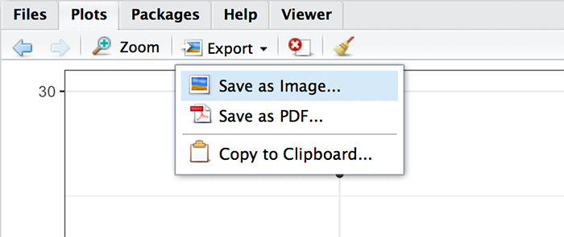

```{r setup, include=FALSE}
library(forcats)
library(learnr)
library(tidyverse)
#library(ggplot2)
knitr::opts_chunk$set(echo = FALSE)
tutorial_options(exercise.cap = "Exercise")

hint_text <- function(text, text_color = "#E69F00"){
  hint <- paste("<font color='", text_color, "'>", text, "</font>", sep = "")
  return(hint)
}

#Read dat files needed for the tutorial


ha_tib <- adventr::ha_dat
  
```

# An Adventure in R: Summarizing data (introducing ggplot2)

## Overview

This tutorial is one of a series that accompanies [An Adventure in Statistics](https://www.discoveringstatistics.com/books/an-adventure-in-statistics/) [@RN10163] by me, [Andy Field](https://en.wikipedia.org/wiki/Andy_Field_(academic)). These tutorials contain abridged sections from the book so there are some copyright considerations but I offer them under a [Creative Commons Attribution-NonCommercial-NoDerivatives 4.0 International License](http://creativecommons.org/licenses/by-nc-nd/4.0/), ^[Basically you can use this tutorial for teaching and non-profit activities but do not meddle with it or claim it as your own work.]

* Who is the tutorial aimed at?
    - Anyone teaching from or reading [An Adventure in Statistics](https://www.discoveringstatistics.com/books/an-adventure-in-statistics/)  may find them useful.
* What is covered?
    - This tutorial looks at how to summarize data both with graphs by introducing the basics of the `ggplot2` package, which is part of the `tidyverse` package. It would be a useful tutorial to run alongside teaching based on Chapter 3 of [An Adventure in Statistics](https://www.discoveringstatistics.com/books/an-adventure-in-statistics/).
    - This tutorial *does not* teach the background theory: it is assumed you have either attended my lecture or read the relevant chapter in the aforementioned books (or someone else's)
    - The aim of this tutorial is to augment the theory that you already know by guiding you through fitting linear models using **R** and **RStudio** and asking you questions to test your knowledge along the way.
    

## Story précis

### Why a précis?

Because these tutorials accompany my book *An adventure in statistics*, which uses a fictional narrative to teach the statistics, some of the examples might not make sense unless you know something about the story. For those of you who don't have the book I begin each tutorial with a précis of the story. If you're not interested then fair enough - click past this section.

### General context for the story

It is the future. Zach, a rock musician and Alice, a geneticist, who have been together since high school live together in Elpis, the ‘City of Hope’.

Zach and Alice were born in the wake of the Reality Revolution which occurred after a Professor Milton Gray invented the Reality Prism – a transparent pyramid worn on the head – that brought honesty to the world. Propaganda and media spin became unsustainable, religions collapsed, advertising failed. Society could no longer be lied to. Everyone could know the truth about anything that they could look at. A gift, some said, to a previously self-interested, self-obsessed society in which the collective good had been eroded. 

But also a curse. For, it soon became apparent that through this Reality Prism, people could no longer kid themselves about their own puffed-up selves as they could see what they were really like – by and large, pretty ordinary. And this caused mass depression. People lost faith in themselves. Artists abandoned their pursuits, believing they were untalented and worthless. 

Zach and Alice have never worn a Reality Prism and have no concept of their limitations. They were born after the World Governance Agency (WGA) destroyed all Reality Prisms, along with many other pre-revolution technologies, with the aim of restoring community and well-being. However, this has not been straightforward and in this post-Prism world, society has split into pretty much two factions

* The Chippers who have had WiFi-enabled chips implanted into their brains, enabling them to record and broadcast what they see and think in real time; upload memories for future generations into a newly-created memoryBank and live-stream music and films directly into their brains. 
* The Clocktarians, followers of the old pre-Prism ways who use steam punk style technologies, who have elected not to have chips in their brains, regarded by the Chippers as backward-looking stuck in a ‘clockwork, Victorian society’. 

Everyone has a star, a limitless space on which to store their digital world.

Zach and Alice are Clocktarians. Their technology consists mainly of:

* A Proteus, a device made from programmable matter that can transform shape and function simply by the owners’ wishes. Zach calls his a diePad, in the shape of a tombstone in an ironic reference to an over-reliance on technology at the expense of memory. 
* A Reality Checker, a clockwork mechanism that, at the point of critical velocity, projects an opaque human head that is linked to everything and can tell you anything. Every head has a personality and Zach’s is a handsome, laid back ‘dude’ who is like an electronic friend, who answers questions if he feels like it and often winds Zach up by giving him false information. And he often flirts with Alice.

### Main Protagonists

* Zach
    - Rock musician in band called The Reality Enigma.
    - Spellbinding performer, has huge fan-base.
    - Only people living in Elpis get to see The Reality Enigma in the flesh. Otherwise all performances are done via an oculus riff, a multisensory headset for experiencing virtual gigs.
    - Zach’s music has influenced and changed thousands of lives. 
    - Wishes he had lived pre-Revolutionary times, the turn of the 21st Century, a golden age for music when bands performed in reality at festivals.
    - Kind, gentle and self-doubting.
    - Believes science and maths are dull and uninspiring. Creates a problem between him and Alice as she thinks that because he isn’t interested in science, he isn’t interested in her. Leads to lots of misunderstandings between them. 
* Alice
    - Shy, lonely, academically-gifted – estranged from the social world until she met Zach in the college library. 
    - Serious scientist, works at the Beimeni Centre of Genetics. 
    - At 21, won the World Science Federation’s Einstein Medal for her genetics research
    - Desperately wants Zach to get over his fear of science so he can open his mind to the beauty of it.

### How Zach's adventure begins

Alice has been acting strangely, on edge for weeks, disconnected and uncommunicative, as if she is hiding something and Zach can’t get through to her. Arriving home from band practice, unusually, she already home and listening to an old album that the two of them enjoyed together, back in a simpler, less complicated time in their relationship. During an increasingly testy evening, that involves a discussion with the Head about whether or not a Proteus causes brain cancer, Alice is interrupted by an urgent call which she takes in private. She returns looking worried and is once again, distracted. She tells Zach that she has ‘a big decision to make’. Before going to bed, Zach asks her if he can help with the decision but she says he ‘already has’, thanking him for making ‘everything easier.’ He has no idea what she means and goes to sleep, uneasy.

On waking, Zach senses that something is wrong. And he is right. Alice has disappeared. Her clothes, her possessions and every photo of them together have gone. He can’t get hold of any of her family or friends as their contact information is stored on her Proteus, not on his diePad. He manages to contact the Beimeni Centre but is told that no one by the name of Alice Nightingale has ever worked there. He logs into their constellation but her star has gone.  He calls her but finds that her number never existed. She has, thinks Zach, been ‘wiped from the planet.’ He summons The Head but he can’t find her either. He tells Zach that there are three possibilities: Alice has doesn’t want to be found, someone else doesn’t want her to be found or she never existed. 

Zach calls his friend Nick, fellow band member and fan of the WGA-installed Repositories, vast underground repositories of actual film, books, art and music. Nick is a Chipper – solely for the purpose of promoting the band using memoryBank – and he puts the word out to their fans about Alice missing. 

Thinking as hard as he can, Zach recalls the lyrics of the song she’d been playing the previous evening. Maybe they are significant? It may well be a farewell message and the Head is right. In searching for clues, he comes across a ‘memory stone’ which tells him to read what’s on there. File 1 is a research paper that Zach can’t fathom. It’s written in the ‘language of science’ and the Head offers to help Zach translate it and tells him that it looks like the results of her current work were ‘gonna blow the world’. Zach resolves to do ‘something sensible’ with the report.  

Zach doesn’t want to believe that Alice has simply just left him. Rather, that someone has taken her and tried to erase her from the world. He decides to find her therapist, Dr Murali Genari and get Alice’s file. As he breaks into his office, Dr Genari comes up behind him and demands to know what he is doing. He is shaking but not with rage – with fear of Zach. Dr Genari turns out to be friendly and invites Zach to talk to him. Together they explore the possibilities of where Alice might have gone and the likelihood, rating her relationship satisfaction, that she has left him. During their discussion Zach is interrupted by a message on his diePad from someone called Milton. Zach is baffled as to who he is and how he knows that he is currently discussing reverse scoring. Out of the corner of his eye, he spots a ginger cat jumping down from the window ledge outside. The counsellor has to go but suggests that Zach and ‘his new friend Milton’ could try and work things out.

## Packages and data
### Packages

This tutorial uses the following packages:

* `tidyverse` [@RN11407]

This package is automatically loaded within this tutorial. If you are working outside of this tutorial (i.e. in **RStudio**) then you need to make sure that the package has been installed by executing `install.packages("package_name")`, where *package_name* is the name of the package. If the package is already installed, then you need to reference it in your current session by executing `library(package_name)`, where *package_name* is the name of the package.

### Data

This tutorial has the data files pre-loaded so you shouldn't need to do anything to access the data from within the tutorial. However, if you want to play around with what you have learnt in this tutorial outside of the tutorial environment (i.e. in a stand-alone **RStudio** session) you will need to download the data files and then read them into your **R** session. This tutorial uses the following file:

* [ais_ch03_ha.csv](http://www.discoveringstatistics.com/repository/ais_data/ais_c03_ha.csv).

You can load the file in several ways:

* Assuming that you save this file into the working directory, you can load it by executing:
    - `ha_tib <- read_csv("ais_ch03_ha.csv")`
    - If you save the file somewhere other than the working directory, you will need to specify the file location (see the tutorial called *adventr_02*)
* To load the file using a standard dialogue box to navigate your file system, execute:
    - `ha_tib <- read_csv(file.choose())`
* You can load the file direct from the URL (i.e., you don't need to download it first) by executing:
    - `ha_tib <- read_csv("http://www.discoveringstatistics.com/repository/ais_data/ais_c03_ha.csv")`
    - This method relies on an internet connection (and my server having not exploded!)

## ggplot2

In Chapter 3 of the book, Zach visits Alice's boss, Professor Catherine Pincus, in the hope that she might have clues as to where Alice has gone. When inspecting Alice's file, which he obtained from her counsellor, Zach found completed questionnaires (the relationship assessment scale, RAS) measuring her relationship satisfaction. He is convinced that Alice has left him because she is dissatisfied with their relationship. Prof. Pincus helps Zach to explore this idea by looking at data from a study by [@RN9017] who investigated what characteristics 1,913 teenagers (aged 13-18) valued in relationship partners. She gave adolescents a list of 21 characteristics of a future partner (reliable, honest, kind, attractive, healthy, sense of humour, gets along with friends, interesting personality, caring, romantic, flexible, intelligent, ambitious, easy going, educated, creative, wants to have children, high salary, good family, has relationship experience, and religious) and asked them to rate each one along a 10-point scale ranging from 1 (not important at all) to 10 (very important).’ A sub-sample of these scores are in a tibble called `ha_tib`. Use the code box to inspect this tibble.

```{r ha_data, exercise=TRUE}

```

```{r ha_data-solution}
ha_tib
```

You should see that the tibble contains 13 variables:

* **id**: Participant ID
* **age**: Age of the participant, years
* **Sex**: Biological sex of the individual
* **hi_salary**: Rating (out of 10) of the importance of a high salary in a potential romantic partner
* **fin_ed**: Rating (out of 10) of the importance of a potential romantic partner having finished their education
* **kind**: Rating (out of 10) of the importance of a potential romantic partner being kind
* **humour**: Rating (out of 10) of the importance of a potential romantic partner having a sense of humour
* **ambitious**: Rating (out of 10) of the importance of a potential romantic partner being ambitious
* **wants_child**: Rating (out of 10) of the importance of a potential romantic partner wanting children
* **romantic**: Rating (out of 10) of the importance of a potential romantic partner being romantic
* **attractive**: Rating (out of 10) of the importance of a potential romantic partner being physically attractive
* **creativity**: Rating (out of 10) of the importance of a potential romantic partner being creative
* **honest**:  Rating (out of 10) of the importance of a potential romantic partner being honest

Catherine produced a histogram of the scores for the variables **hi_salary**, **kind**, **humour** and **ambitious**.

The best package for producing graphs in **R** is [ggplot2](http://ggplot2.tidyverse.org/) which automatically installs as part of the `tidyverse` package. `ggplot2` is great because it is so versatile, but the price for its versatility is that it is extremely complicated. In my other book [@RN4832] I dedicate an entire chapter to it and still only scratch the surface. Through these tutorials we will learn by doing rather than me trying to explain every aspects of `ggplot`.

Figure 1 shows how `ggplot2` works. You begin with some data and you initialize a plot with the `ggplot()` function within which you name the tibble or data frame that you want to use, then you set a bunch of aesthetics using the `aes()` function. Primarily, you name the variable you want plotted on the *x*-axis, the variable for the *y*-axis and any aesthetics that you want to set for the plot using a variable (for example, you might want to vary the colour of bars by levels of a variable.). You then add layers to the plot that control what the plot shows and the visual properties. For example, you might add bars to show group means, then layer on top error bars. There are various key concepts that relate to controlling aspects of the layers of the plot:

* **Aesthetics**: objects in a plot have visual aesthetics that control how they look. Examples of aesthetics are the fill colour of points and bars, line colours (of lines, error bars, lines around bars), the shape of data points, the size of data points, the type of line (full, dashed, dotted etc.). These can be set directly for an object (e.g., making all data points red) or can be set using a variable (e.g., colouring data points based on whether it came from an experimental or control group). When setting an aesthetic based on a variable we use the `aes()` function. 
* **Geometric objects**: these are objects that represent data. Some examples are bars to represent means, dots to represent raw data (or a summary such as a mean), lines connecting data points or summarizing data (e.g., a line of best fit, lines connecting group means), error bars, and so on. There are different functions relating to different geoms, within which there will be different options that you can set, for example:
    - `geom_point()` plots data points (by default dots)
    - `geom_bar()` plots bars
    - `geom_boxplot()` plots boxplots
    - `geom_histogram()` plots histograms
    - `geom_errorbar()` plots error bars
    - `geom_smooth()` plots summary lines (e.g., linear models and splines)
* **Statistics**: there are situations where rather than using a geom function to display the data it is easier to map a summary of the data directly to the plot with various `stat` functions (usually `stat_summary()`). It's a little complex to explain when you use stats instead of geoms, so we'll just learn by doing!
* **Scales**: These control the details of how the data are mapped to their visual objects. For example, you can control what appears on the *x* and *y* axis (i.e. intervals between values) using `scale_x_continuous()` and `scale_y_continuous()`, axis labels are controlled with `labs()`, and you can over-ride the default colour schemes for fills and colours by specifying your own colours within `scale_fill_manual()` and `scale_colour_manual()`.
* **Coordinate system**: by default `ggplot2` uses a Cartesian system, which will be fine for our purposes. However, we will use `coord_cartesian()` to set the limits of the *x* and *y* axis. You may find `coord_flip()` useful if you ever want to transpose the *x* and *y* axes.
* **Position adjustments**: sometimes elements of a plot overlap (e.g., lots of data points in the same place). There are various position adjustments that can be useful such as `position_dodge()` which forces objects not to overlap side by side (handy for complex bar charts) and `position_jitter()` which adds a small random adjustment to data points.
* **Facets**: facets can be used to plot different parts of the data in different panels. For example, if you wanted a plot of data from men and a separate plot of the same data for women and you wanted these plots side by side, you could do this with `facet_wrap()`.
* **Themes**: Themes are a set of instructions about how a plot should look (what font is used, font sizes, whether to show grid lines, colours of all visual elements, etc.). There are a number of built in themes that you can apply to your plots. At an advanced level you can even write your own themes and apply them. For example, when writing textbooks, I write a theme that controls fonts (family and size), fill colours, background colours, grid lines etc.. Whenever I create a plot I apply that theme and know that all of the plots within my book will look consistent. For our purposes we will just use built in themes, but occasionally over-ride defaults with the `theme()` function.

This is a lot to take in, so consider this a reference point (rather than expecting to remember all of the above) and we'll get a feel for `ggplot2` by doing examples as we progress through the module. You may also find the [official reference guide](http://ggplot2.tidyverse.org/reference/index.html) helpful.


## Histograms

### A basic histogram using `ggplot2`

Let's start by plotting a histogram of the scores for **humour**. To initiate the plot we use the `ggplot()` function, which at its simplest has this general form:

`my_plot <- ggplot(my_data, aes(variable for x axis, variable for y axis))`

This command creates a new graph object called *my_plot*, and within the `ggplot()` function I have told `ggplot2` to use the tibble called *my_data*, and I name the variables to be plotted on the x (horizontal) and y (vertical) axis within the aes() function. We can also set other aesthetic values at this top level. For example, if we had a variable called **sex** representing the biological sex of participants and we wanted our layers/geoms to display data from males and females in different colours then we could execute:

`my_plot <- ggplot(my_data, aes(variable for x axis, variable for y axis, colour = sex))`

In doing so any subsequent geom that we define will take on the aesthetic of producing different colours for males and females assuming that this is a valid aesthetic for the particular geom. If you set a general aesthetic like this, you can override it within the specific geom function. To plot the ratings given to the characteristic of being humorous we could execute:

`humour_hist <- ggplot(ha_tib, aes(humour))`

This command creates a new graph object called *humour_hist* using the tibble called *ha_tib*, and plotting the variable **humour** on the *x* axis (for a histogram we don't need to specify *y*. This command tells `ggplot2` *what* to plot, but not *how* to plot it. We need to add a geom to display the data. If we want a histogram we could execute:

`humour_hist + geom_histogram()`

This command tells **R** to take the object *humour_hist* (which we created above) and add (`+`) a layer to it using `geom_histogram()`.

`r hint_text("Tip: for more complex plots you will add lots of different layers, so it is helpful to structure the command with a different layer on each line. I tend to specify a layer then include the + symbol, then hit return to specify the next layer. **RStudio** will indent the lines for you making it easier to read. See the example in the code box below.")`

The full code is in the box below, execute it to see what happens.

```{r humour_hist, exercise=TRUE}
humour_hist <- ggplot(ha_tib, aes(humour))
humour_hist +
  geom_histogram()
```

By default `ggplot2` constructs the bins of the histogram to be 1/30th the width of the data. You can over-ride this default by specifying `binwidth = ` within the `geom_histogram()` function. In the code box above, type `binwidth = 1` into the brackets after `geom_histogram` and execute the code. Note how the histogram changes. Feel free to try other binwidths, but 1 makes sense because responses could only be whole numbers.

### Changing the colours of the bars

We can change the colour of the bars by including `fill = ` within the `geom_histogram()` function. For example, we could specify the colour red as:

`geom_histogram(binwidth = 1, fill = "red")`

Try this in the code box below and run the code.

`r hint_text("Tip: Note that options within a function are separated by a comma. In this example, \'binwidth = 1, fill = \"red\"\' will work but \'binwidth = 1 fill = \"red\"\' (note the comma is missing) would throw an error.")`

You can also specify any [Hex colour code](http://www.color-hex.com/). For example, the shade of blue defined by hex code "#56B4E9" is good for colour blind people, so we could specify this:

`geom_histogram(binwidth = 1, fill = "#56B4E9")`

Try this below by replacing `"red"` with `"#56B4E9"` and running the code. Play around with other hex codes.

```{r humour_hist_fill, exercise=TRUE}
humour_hist <- ggplot(ha_tib, aes(humour))
humour_hist +
  geom_histogram(binwidth = 1)
```

You can also make filled objects semi-transparent by using `alpha = ` where alpha is a proportion (i.e., between 0 and 1). For example, if you want the histograms to have 20% opacity you could include  `alpha = 0.2` in the `geom_histogram()` function (remembering to separate it from other options with a comma). In the code box above try setting 50% opacity by editing the geom to be:

`geom_histogram(binwidth = 1, fill = "#56B4E9", alpha = 0.5)`

### Editing axis labels

Run the code below to view the histogram so far. Lets add a layer than changes the *y*-axis label to 'Frequency' and the *x*-axis label to 'Importance of humour (1-10)'. We can do this by adding a `+` after the `geom_histogram()` function and on the next line typing:

`labs(y = "Frequency", x = "Importance of humour (1-10)")`

Do this and run the code again.

```{r humour_hist_labs, exercise = TRUE}
humour_hist <- ggplot(ha_tib, aes(humour))
humour_hist +
  geom_histogram(binwidth = 1, fill = "#56B4E9")
```


```{r humour_hist_labs-solution}
humour_hist <- ggplot(ha_tib, aes(humour))
humour_hist +
  geom_histogram(binwidth = 1, fill = "#56B4E9") +
  labs(y = "Frequency", x = "Importance of humour (1-10)")
```

### Editing axis limits and breaks

Run the code below to view the histogram so far.

At the moment the *x*-axis is scaled from 5 to 10. Let's show the full range of the scale. To do this we need to set the limits of the *x*-axis using the `coord_cartesian()` function:

`coord_cartesian(xlim = c(begin, end), ylim = c(begin, end))`

You set the limits of the *x*-axis using `xlim` and the limits of the *y*-axis with `ylim`. After each you specify numbers representing the start and end values for the axis. You need to collect these values into a single object by enclosing them in `c()`. So, to set the *x*-axis to begin at 1 and end at 10 (the lowest and highest points of the scale) add a `+` after the `geom_histogram()` function and on the next line type:

`coord_cartesian(xlim = c(1, 10))`

Add this line to the code box below and run the code to see how the limits of the *x*-axis change.

`r hint_text("Tip: You may notice that you can also set limits using scale_x_continuous(). However, if you do this then data outside of the limits you set are discarded. Therefore, most of the time we would use coord_cartesian() because it leaves the underlying data alone.")`

Now let's add a layer that changes what breaks are displayed on the *x*-axis. At the moment the *x*-axis displays 2.5, 5, 7.5, and 10 Let's change this to display the numbers 1 to 10 In **R** we can generate this sequence of numbers by using `:`. For example, `1:5` will return 1, 2, 3, 4, 5. The *x*-axis displays a continuous variable (**humour**) so we can use the function `scale_x_continuous()` to change aspects of this axis. In particular, the `breaks = ` option will over-ride the default breaks along the axis.

In the code box below, type `+` after the `coord_cartesian()` function and on the next line type:

`scale_x_continuous(breaks = 1:10)`

Execute this code and pay attention to the numbers displayed along the *x*-axis.

```{r humour_hist_lims, exercise = TRUE}
humour_hist <- ggplot(ha_tib, aes(humour))
humour_hist +
  geom_histogram(binwidth = 1, fill = "#56B4E9") + 
  labs(y = "Frequency", x = "Importance of humour (1-10)")
```


```{r humour_hist_lims-solution}
humour_hist <- ggplot(ha_tib, aes(humour))
humour_hist +
  geom_histogram(binwidth = 1, fill = "#56B4E9") +
  labs(y = "Frequency", x = "Importance of humour (1-10)") +
  coord_cartesian(xlim = c(1, 10)) +
  scale_x_continuous(breaks = 1:10)
```

### Changing theme

Run the code below to view the histogram so far. Let's apply the built-in theme `theme_bw()` (which is probably the most useful for creating publication style images). To do this type `+` after the `scale_x_continuous()` function and on the next line type:

`theme_bw()`

Add this line to the code box below and run the code to see the theme change:

```{r humour_hist_full, exercise=TRUE}
humour_hist <- ggplot(ha_tib, aes(humour))
humour_hist +
  geom_histogram(binwidth = 1, fill = "#56B4E9") +
  labs(y = "Frequency", x = "Importance of humour (1-10)") +
  coord_cartesian(xlim = c(1, 10)) +
  scale_x_continuous(breaks = 1:10)
```

```{r humour_hist_full-solution}
humour_hist <- ggplot(ha_tib, aes(humour))
humour_hist +
  geom_histogram(binwidth = 1, fill = "#56B4E9") +
  labs(y = "Frequency", x = "Importance of humour (1-10)") +
  coord_cartesian(xlim = c(1, 10)) +
  scale_x_continuous(breaks = 1:10) + 
  theme_bw()
```

Now try changing `theme_bw()` to `theme_minimal()`, `theme_classic()` and `theme_dark()` to see what effect it has on the plot.

### Other variables

To see histograms of the other variables (e.g., **hi_salary**, **kind** and **ambitious**) we can simply replace **humour** in the code box above with these variables. Try this and run the code to view the resulting histograms.

## Frequency polygons
### A basic frequency polygon

We can plot frequency polygons in the same way but replacing `geom_histogram()` with `geom_freqpoly()`. The code in the exercise has done this. Note a few changes:

* I have named the object *humour_poly* instead of *humour_hist* to reflect what it represents.
* within the `freq_poly()` I have replace `fill` with `colour`. This is because there is no *fill* option for frequency polygons so if you include *fill* you will get a warning. By changing to `colour` I am setting the colour of the line.


```{r humour_poly_full, exercise=TRUE}
humour_poly <- ggplot(ha_tib, aes(humour))
humour_poly +
  geom_freqpoly(binwidth = 1, colour = "#56B4E9") +
  labs(y = "Frequency", x = "Importance of humour (1-10)") +
  coord_cartesian(xlim = c(1, 10)) +
  scale_x_continuous(breaks = 1:10) +
  theme_bw()
```

Run the code to see what the polygon looks like.

### Line size

We can change the size of the line by including the `size = ` option in the `geom_freqpoly()` function. Remember that options within a function need to be separated by commas, so in the code box above add `size = 2` to the `geom_freqpoly()` function so that it reads:

`geom_freqpoly(binwidth = 1, colour = "#56B4E9", size = 2)`

Try some other sizes if you like.

### Line style

We can change the style of the line by including the `linetype = ` option in the `geom_freqpoly()` function. Line types can either be defined using numbers (0 = blank, 1 = solid (default), 2 = dashed, 3 = dotted, 4 = dotdash, 5 = longdash, 6 = twodash) or as text ("blank", "solid", "dashed", "dotted", "dotdash", "longdash", or "twodash"). For example, we could change the line to a dashed line by adding either `linetype = 2` or `linetype = "dashed"` to the `geom_freqpoly()` function. Remember that options within a function need to be separated by commas, so in the code box above edit the `geom_freqpoly()` function to read:

`geom_freqpoly(binwidth = 1, colour = "#56B4E9", linetype = 2)` or
`geom_freqpoly(binwidth = 1, colour = "#56B4E9", linetype = "dashed")`

Try some other styles if you like.

We can of course specify both the style and size by adding both options and separating them with a comma. In the code box above edit the `geom_freqpoly()` function to read:

`geom_freqpoly(binwidth = 1, colour = "#56B4E9", size = 2, linetype = 2)`

Try out different combinations of styles and sizes.

### Adding geoms

We can layer several geoms onto the same plot. Imagine, for example, we wanted to plot the frequency polygon on top of the original histogram. We can do this by adding the `geom_freqpoly()` function to our original histogram. The code for the histogram is below. Try adding

`geom_freqpoly(binwidth = 1) + `

underneath the `geom_histogram()` function (the `+` is there because there are commands on the following lines). Now try moving the same command to the line *above* the `geom_histogram()` function. What happens?

You should see the frequency polygon disappear behind the histogram. This illustrates the idea of layering a plot. `ggplot2` processes the functions in order. If `geom_freqpoly(binwidth = 1)` comes before `geom_histogram()` then `ggplot2` draws the polygon first and then layers the histogram on top whereas if `geom_histogram()` comes before `geom_freqpoly(binwidth = 1)` then the histogram is drawn first and the polygon is layered on top of it.

You can use what you know to change the frequency polygon's line to be a pleasant red ("#DF4738") and size 2.

```{r humour_poly_hist, exercise=TRUE}
humour_hist <- ggplot(ha_tib, aes(humour))
humour_hist +
  geom_histogram(binwidth = 1, fill = "#56B4E9") +
  labs(y = "Frequency", x = "Importance of humour (1-10)") +
  coord_cartesian(xlim = c(1, 10)) +
  scale_x_continuous(breaks = 1:10) + 
  theme_bw()
```

```{r humour_poly_hist-solution}
humour_hist <- ggplot(ha_tib, aes(humour))
humour_hist +
  geom_histogram(binwidth = 1, fill = "#56B4E9") +
  geom_freqpoly(binwidth = 1, colour = "#DF4738", size = 2) +
  labs(y = "Frequency", x = "Importance of humour (1-10)") +
  coord_cartesian(xlim = c(1, 10)) +
  scale_x_continuous(breaks = 1:10) + 
  theme_bw()
```

As we work through the module we'll learn how to do other things with `ggplot2` but you should, hopefully, now have an idea of how the package works.

## Saving plots

You can use the `ggsave()` function to save plots (this is what I generally use) but most people find it easier to click on  in the pane of **RStudio** where the plot is displayed. This activates a drop-down menu that lets you save the current plot as an image or a PDF file or copy it to the clipboard:



Saving to an image or PDF will open a fairly self-explanatory dialog box in which you specify the name of the file, the directory in which to save it, the image format and the size of the image. If you use a [Notebook](https://bookdown.org/yihui/rmarkdown/notebook.html) or [R Markdown](https://bookdown.org/yihui/rmarkdown/) file you don't need to worry about saving images.

## Other resources

### Statistics

* The tutorials typically follow examples described in detail in @RN10163, so for most of them there's a thorough account in there. You might also find @RN4832 useful for the **R** stuff.
* There are free lectures and screen casts on my [YouTube channel](https://www.youtube.com/user/ProfAndyField/)
* There are free statistical resources on my website [www.discoveringstatistics.com](http://www.discoveringstatistics.com)

### R

* Information on using [ggplot2](http://ggplot2.tidyverse.org/) 
* [R for data science](http://r4ds.had.co.nz/index.html) is the open-access version of the book by tidyverse creator Hadley Wickham [@RN11404]. It covers the *tidyverse* and data management.
* [ModernDive](http://moderndive.com/index.html) is an open-access textbook on **R** and **RStudio**
* [RStudio cheat sheets](https://www.rstudio.com/resources/cheatsheets/)
* [RStudio list of online resources](https://www.rstudio.com/online-learning/)
* [SwirlStats](http://swirlstats.com/students.html) is a package for *R* that launches a bunch of interactive tutorials.

## References
