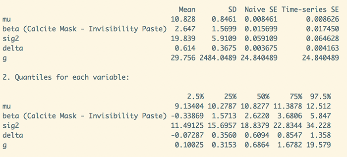

```{r setup, include=FALSE}
library(forcats)
library(learnr)
library(tidyverse)
library(BayesFactor)
library(lm.beta)
library(robust)
library(sjstats)
library(WRS2)

knitr::opts_chunk$set(echo = FALSE, warning = FALSE)
tutorial_options(exercise.cap = "Exercise")

hint_text <- function(text, text_color = "#E69F00"){
  hint <- paste("<font color='", text_color, "'>", text, "</font>", sep = "")
  return(hint)
}

#Read dat files needed for the tutorial

mask_tib <- adventr::mask_dat

#setup objects for code blocks


```

# An Adventure in R: Categorial predictors (two categories)

## Overview

This tutorial is one of a series that accompanies [An Adventure in Statistics](https://www.discoveringstatistics.com/books/an-adventure-in-statistics/) [@RN10163] by me, [Andy Field](https://en.wikipedia.org/wiki/Andy_Field_(academic)). These tutorials contain abridged sections from the book so there are some copyright considerations but I offer them under a [Creative Commons Attribution-NonCommercial-NoDerivatives 4.0 International License](http://creativecommons.org/licenses/by-nc-nd/4.0/), ^[Basically you can use this tutorial for teaching and non-profit activities but do not meddle with it or claim it as your own work.]

* Who is the tutorial aimed at?
    - Anyone teaching from or reading [An Adventure in Statistics](https://www.discoveringstatistics.com/books/an-adventure-in-statistics/)  may find them useful.
* What is covered?
    - This tutorial looks at how to fit a linear model with a predictor variable that represents two independent categories. We look at robust variants of the model, and computing a Bayes factor. It would be a useful tutorial to run alongside teaching based on Chapter 15 of [An Adventure in Statistics](https://www.discoveringstatistics.com/books/an-adventure-in-statistics/).
    - This tutorial *does not* teach the background theory: it is assumed you have either attended my lecture or read the relevant chapter in the aforementioned books (or someone else's)
    - The aim of this tutorial is to augment the theory that you already know by guiding you through fitting linear models using **R** and **RStudio** and asking you questions to test your knowledge along the way.
    

## Story précis

### Why a précis?

Because these tutorials accompany my book *An adventure in statistics*, which uses a fictional narrative to teach the statistics, some of the examples might not make sense unless you know something about the story. For those of you who don't have the book I begin each tutorial with a précis of the story. If you're not interested then fair enough - click past this section.

### General context for the story

It is the future. Zach, a rock musician and Alice, a geneticist, who have been together since high school live together in Elpis, the ‘City of Hope’.

Zach and Alice were born in the wake of the Reality Revolution which occurred after a Professor Milton Gray invented the Reality Prism – a transparent pyramid worn on the head – that brought honesty to the world. Propaganda and media spin became unsustainable, religions collapsed, advertising failed. Society could no longer be lied to. Everyone could know the truth about anything that they could look at. A gift, some said, to a previously self-interested, self-obsessed society in which the collective good had been eroded. 

But also a curse. For, it soon became apparent that through this Reality Prism, people could no longer kid themselves about their own puffed-up selves as they could see what they were really like – by and large, pretty ordinary. And this caused mass depression. People lost faith in themselves. Artists abandoned their pursuits, believing they were untalented and worthless. 

Zach and Alice have never worn a Reality Prism and have no concept of their limitations. They were born after the World Governance Agency (WGA) destroyed all Reality Prisms, along with many other pre-revolution technologies, with the aim of restoring community and well-being. However, this has not been straightforward and in this post-Prism world, society has split into pretty much two factions

* The Chippers who have had WiFi-enabled chips implanted into their brains, enabling them to record and broadcast what they see and think in real time; upload memories for future generations into a newly-created memoryBank and live-stream music and films directly into their brains. 
* The Clocktarians, followers of the old pre-Prism ways who use steam punk style technologies, who have elected not to have chips in their brains, regarded by the Chippers as backward-looking stuck in a ‘clockwork, Victorian society’. 

Everyone has a star, a limitless space on which to store their digital world.

Zach and Alice are Clocktarians. Their technology consists mainly of:

* A Proteus, a device made from programmable matter that can transform shape and function simply by the owners’ wishes. Zach calls his a diePad, in the shape of a tombstone in an ironic reference to an over-reliance on technology at the expense of memory. 
* A Reality Checker, a clockwork mechanism that, at the point of critical velocity, projects an opaque human head that is linked to everything and can tell you anything. Every head has a personality and Zach’s is a handsome, laid back ‘dude’ who is like an electronic friend, who answers questions if he feels like it and often winds Zach up by giving him false information. And he often flirts with Alice.

### Main Protagonists

* Zach
    - Rock musician in band called The Reality Enigma.
    - Spellbinding performer, has huge fan-base.
    - Only people living in Elpis get to see The Reality Enigma in the flesh. Otherwise all performances are done via an oculus riff, a multisensory headset for experiencing virtual gigs.
    - Zach’s music has influenced and changed thousands of lives. 
    - Wishes he had lived pre-Revolutionary times, the turn of the 21st Century, a golden age for music when bands performed in reality at festivals.
    - Kind, gentle and self-doubting.
    - Believes science and maths are dull and uninspiring. Creates a problem between him and Alice as she thinks that because he isn’t interested in science, he isn’t interested in her. Leads to lots of misunderstandings between them. 
* Alice
    - Shy, lonely, academically-gifted – estranged from the social world until she met Zach in the college library. 
    - Serious scientist, works at the Beimeni Centre of Genetics. 
    - At 21, won the World Science Federation’s Einstein Medal for her genetics research
    - Desperately wants Zach to get over his fear of science so he can open his mind to the beauty of it.

### How Zach's adventure begins

Alice has been acting strangely, on edge for weeks, disconnected and uncommunicative, as if she is hiding something and Zach can’t get through to her. Arriving home from band practice, unusually, she already home and listening to an old album that the two of them enjoyed together, back in a simpler, less complicated time in their relationship. During an increasingly testy evening, that involves a discussion with the Head about whether or not a Proteus causes brain cancer, Alice is interrupted by an urgent call which she takes in private. She returns looking worried and is once again, distracted. She tells Zach that she has ‘a big decision to make’. Before going to bed, Zach asks her if he can help with the decision but she says he ‘already has’, thanking him for making ‘everything easier.’ He has no idea what she means and goes to sleep, uneasy.

On waking, Zach senses that something is wrong. And he is right. Alice has disappeared. Her clothes, her possessions and every photo of them together have gone. He can’t get hold of any of her family or friends as their contact information is stored on her Proteus, not on his diePad. He manages to contact the Beimeni Centre but is told that no one by the name of Alice Nightingale has ever worked there. He logs into their constellation but her star has gone.  He calls her but finds that her number never existed. She has, thinks Zach, been ‘wiped from the planet.’ He summons The Head but he can’t find her either. He tells Zach that there are three possibilities: Alice has doesn’t want to be found, someone else doesn’t want her to be found or she never existed. 

Zach calls his friend Nick, fellow band member and fan of the WGA-installed Repositories, vast underground repositories of actual film, books, art and music. Nick is a Chipper – solely for the purpose of promoting the band using memoryBank – and he puts the word out to their fans about Alice missing. 

Thinking as hard as he can, Zach recalls the lyrics of the song she’d been playing the previous evening. Maybe they are significant? It may well be a farewell message and the Head is right. In searching for clues, he comes across a ‘memory stone’ which tells him to read what’s on there. File 1 is a research paper that Zach can’t fathom. It’s written in the ‘language of science’ and the Head offers to help Zach translate it and tells him that it looks like the results of her current work were ‘gonna blow the world’. Zach resolves to do ‘something sensible’ with the report.  

Zach doesn’t want to believe that Alice has simply just left him. Rather, that someone has taken her and tried to erase her from the world. He decides to find her therapist, Dr Murali Genari and get Alice’s file. As he breaks into his office, Dr Genari comes up behind him and demands to know what he is doing. He is shaking but not with rage – with fear of Zach. Dr Genari turns out to be friendly and invites Zach to talk to him. Together they explore the possibilities of where Alice might have gone and the likelihood, rating her relationship satisfaction, that she has left him. During their discussion Zach is interrupted by a message on his diePad from someone called Milton. Zach is baffled as to who he is and how he knows that he is currently discussing reverse scoring. Out of the corner of his eye, he spots a ginger cat jumping down from the window ledge outside. The counsellor has to go but suggests that Zach and ‘his new friend Milton’ could try and work things out.

## Packages and data
### Packages

This tutorial uses the following packages:

* `BayesFactor` [@RN9444] to compute Bayes factors
* `boot` [@RN11409] to compute bootstrap confidence intervals.
* `lm.beta` [@RN11412] to compute standardized *b*-values
* `robust` [@RN11411] to compute robust estimates
* `sjstats` [@RN11413] to produce robust parameter estimates and confidence intervals
* `tidyverse` [@RN11407] for general data processing
* `WRS2` [@RN10205] to do various robust tests

These packages are automatically loaded within this tutorial. If you are working outside of this tutorial (i.e. in **RStudio**) then you need to make sure that the package has been installed by executing `install.packages("package_name")`, where *package_name* is the name of the package. If the package is already installed, then you need to reference it in your current session by executing `library(package_name)`, where *package_name* is the name of the package.

### Data

This tutorial has the data files pre-loaded so you shouldn't need to do anything to access the data from within the tutorial. However, if you want to play around with what you have learnt in this tutorial outside of the tutorial environment (i.e. in a stand-alone **RStudio** session) you will need to download the data files and then read them into your **R** session. This tutorial uses the following file:

* [ais_15_masks.csv](http://www.discoveringstatistics.com/repository/ais_data/ais_15_masks.csv).

You can load the file in several ways:

* Assuming that you follow the workflow recommended in the tutorial **adventr_02** (see also this [online tutorial](http://milton-the-cat.rocks/learnr/r/r_getting_started/#section-working-in-rstudio)), you can load the data into an object called `mask_tib` by executing:
    - `mask_tib <- readr::read_csv("../data/ais_15_masks.csv")`
    - If you don't follow my suggested workflow, you will adjust the file location in the above command.
* Alternatively, if you have an internet connection (and my server has not exploded!) load the file direct from the URL by executing:
    - `mask_tib <- readr::read_csv("http://www.discoveringstatistics.com/repository/ais_data/ais_15_masks.csv")`


### Categorical variables

When working within the tutorial the data are already prepared for you. However, if you are trying to replicate the tutorial within R or R Studio then you need to explicitly convert categorical predictors to factors. The data for this tutorial contains a variable **mask**, which will be read in from the csv file as a character variable. To convert this variable to a factor we can use the `as_factor()` function from the `forcats` package. There are several ways to do this, but the most tidyverse way is to use `mutate()` from `tidyverse`, which is a way of adding variables to a tibble or overwriting existing variables. We could execute:

```{r, echo = TRUE, eval = FALSE}
library(tidyverse)
mask_tib <- mask_tib %>% 
  dplyr::mutate(
    mask = forcats::as_factor(mask)
  )
```

This code recreates the `mask_tib` tibble from itself then uses mutate to recreate the variable **group** from itself by placing it within the `as_factor()` function. I have explicitly declared that I want to use the `as_factor()` function from the package `forcats` because the package `haven` also has an `as_factor()` function.


## Categorical predictors in the GLM
### The model

During Zach's visit to the JIG:SAW complex he visits several research buildings. In the first, he discovers experiments being conducted related to invisibility. Each participant sat on a revolving chair in the middle of a circle of 20 people. The 20 people all wore a light deflecting aid on their face. For half of the participants (*N* = 14) the 20 people wore a calcite-based mask, whereas the other half (*N* = 14) saw people wearing ‘invisibility paste’, a transparent cream containing calcite micro-crystals. Participants looked at each person and were given two photographs, one depicting the person they were looking at and one depicting a different person matched for age and sex. Participants had to decide which person they were looking at, before turning to the next person and being given two different photographs. Participants scored a point for each person they identified correctly: a score of 0 would mean they always chose the incorrect photo, a score of 20 would mean that they always chose the correct photo. The question is whether the light deflecting aids interfere with facial recognition. The prediction was that the paste would lead to lower recognition than the masks. The data are in the tibble `mask_tib`, which has three variables:

* **id**: Participant ID
* **mask**: Whether the person was assigned to the calcite mask condition or the invisibility paste condition
* **recognition**: How many of the 20 people they correctly identified

The model we're fitting is described by the following equation:

$$
\begin{aligned}
Y_i & = b_0 + b_1X_i+ ε_i\\
\text{recognition}_i & = b_0 + b_1\text{mask}_i+ ε_i
\end{aligned}
$$

### Plotting the data

Let's plot the data. Use the code box below to create an error bar chart with **mask** on the *x*-axis and **recognition** on the *y*-axis. If you feel like it, try to superimpose the raw data. (If you do this last part you'll use the `geom_point()` function, try this, but then add into the function `position = position_jitter(width = 0.1, height = 0)`. This adds what's known as a 'jitter' to the points, which just means that small a random value is added so that the dots don't overlap. By setting width to 0.1, we're limiting the horizontal jitter and disabling the horizontal jitter so that the values on the *y*-axis are true to the actual scores.)

```{r scat, exercise = TRUE, exercise.lines = 8}
     
               
```

```{r scat-solution}
mem_plot <- ggplot2::ggplot(mask_tib, aes(mask, recognition))
mem_plot +
  geom_point(colour = "#E69F00", position = position_jitter(width = 0.1, height = 0)) +
  stat_summary(fun.data = "mean_cl_normal", geom = "pointrange") +
  labs(x = "Experimental group", y = "Recognition (out of 20") +
  coord_cartesian(ylim = c(0, 20)) +
  scale_y_continuous(breaks = 0:20) +
  theme_bw()
```


### Fitting the model

It looks like recognition scores are, indeed lower in the paste condition. To fit the model we use the `lm()` function, because we are fitting a linear model with a categorical predictor. We've used this function before, just to recap it takes the following general form (I've retained only the key options):

`lm(outcome ~ predictor(s), data, subset, na.action = na.fail)`

Using what we've learnt in previous tutorials we could do the following:

* Create a model called `mask_mod` using `lm()`
* Add standardized betas using `lm.beta()` (Remember to execute `library(lm.beta)` first if trying this outside of the tutorial.)
* Summarize the model using `summary()`
* Use `confint()` to get confidence intervals for the model parameters (the *b*s)
* Plot diagnostics with `plot()`

Using these hints, see whether you can fit the model in the code box below

```{r lm1, exercise = TRUE}
     
               
```

```{r lm1-solution}
mask_mod <- lm(recognition ~ mask, data = mask_tib)
mask_mod <- lm.beta(mask_mod)
summary(mask_mod)
confint(mask_mod)
plot(mask_mod)
```

The output provides estimates of the model parameters (the *b*-values) and the significance of these values. The *Y* intercept ($b_0$) is 12.50, which is the value of recognition when **mask** = 0. **R** will have coded the variable **mask** using dummy coding. It will do this alphabetically (unless you tell it something different), which means that it will have coded 'calcite mask' as 0 and 'invisibility paste' as 1 (because *c* comes before *i* in the alphabet).

```{r quiz_b_ex1}
quiz(
  question("How would we interpret the *Estimate* (-3.357) for *maskInvisibility Paste*? [Select **two** correct answers.]",
    answer("As the value of **mask** changed from 0 (calcite paste) to 1 (invisibility paste), recognition scores decrease by 3.357.", correct = T),
    answer("The difference between group means is 3.357.", correct = T),
    answer("As the value of **mask** changed from 0 (calcite paste) to 1 (invisibility paste), recognition scores decrease by 3.357 of a standard deviation", message = "This describes the *standardized* B, not the *unstandardized*."),
    answer("Group membership explains -3.36% of the variance in recognition scores", message = sprintf("This is what $R^2$ tells us and you can't have a negative percentage of variance explained!")),
    correct = "Correct - well done!",
    random_answer_order = TRUE,
    allow_retry = T
  ),
  question("How would we interpret the value of 0.0486 in the column labelled *Pr(>|t|)*? [Select **two** correct answers.]",
    answer("The probability of getting a value of *t* at least as small as -2.069 if the true value of *b* were 0 is 0.0486", correct = T),
    answer("The difference between group means is significantly different at *p* = 0.0486.", correct = T),
    answer("The probability of this being a chance result is 0.0486", message = "*p*-values are long run probabilities and do not tell us anything about the probability associated with the particular samplew ehave collected."),
    answer("The probability of *b* being -3.357 in the population is 0.0486", message = "*p*-values don't tell us about the probability of values in the populatrion*"),
    correct = "Correct - well done!",
    random_answer_order = TRUE,
    allow_retry = T
  )
)
```

The plots look a bit odd when you have a categorical predictor variable. The Q-Q plot does seem to suggest some unusual cases and the residual plots perhaps hint at different variances in the two groups.

### A more traditional approach

We have just used the linear model to compare two means using a *t*-statistic? Does the idea of comparing two means with a *t*-statistic seem familiar? If it does that's probably because you were taught *t*-tests as separate entities. You can do the *t*-test in *R* using the `t.test()` function:
 
 `new_model <- t.test(outcome ~ predictor, data = tibble, paired = FALSE, var.equal = FALSE, conf.level = 0.95, na.action)`

In which:

* `new_model`: an object created that contains information about the model. We can get summary statistics for this model by executing the name of the model.
* `outcome`: the variable that contains the scores for the outcome measure (in this case **recognition**).
* `predictor`: the variable that contains information about to which group a score belongs (in this case **mask**).
* `tibble`: the name of the tibble containing the data (in this case `mask_tib`) 
* `paired`: by default scores are treated as independent (`paired = FALSE`), but if you have a repeated measures design and want to treat scores as dependent change this to `paired = TRUE`
* `var.equal`: by default the function assumes that variances are unequal (`var.equal = FALSE`) and applies Welch's correction (a sensible thing to do). If for some reason you want to assume equal variances include the option `var.equal = TRUE`.
* `conf.level`: determines the alpha level for the *p*-value and confidence intervals. By default it is 0.95 (for 95% confidence intervals) and usually you’d exclude this option, but if you want to use a different value, say 99%, you could include `conf.level = 0.99`.
* `na.action`: If you have complete data (as we have here) exclude this option, but if you have missing values (i.e., ‘NA’s in the data frame) then it can be useful to include `na.action = na.exclude`, which will exclude all cases with missing values

To get a *t*-test for the current data we would execute:

```{r echo = T, eval = F}
t.test(recognition ~ mask, data = mask_tib)
```

or to create an object that we can use later:

```{r, echo = T, eval = F}
mask_t <- t.test(recognition ~ mask, data = mask_tib)
mask_t
```

Try this in the code box:

```{r t1, exercise = TRUE}

```

```{r t1-solution}
mask_t <- t.test(recognition ~ mask, data = mask_tib, var.equal = T)
mask_t
```

The value of *t* (2.0689) and the corresponding *p* (0.04956) are slightly different to when we fitted a linear model. This is because Welch's correction has been applied (and usually this is a good idea). Try adding `var.equal = T` to the `t-test()` function and re-running the code. You should find that the values of *t* and *p* match those from the `lm()` function. [Actually the *t* is 2.0689 rather than -2.0689 but this is just because of how the groups are dummy coded in one function compared to the other. In other words whether you subtract the calcite mean from the paste mean or vice versa.] All of which goes to highlight that the *t*-test is a special case of the linear model.

## Robust models
### Robust standard errors

To apply a Welch-style correction to the linear model we can use one of the methods we learnt before for producing standard errors (and hence confidence intervals) that are robust to heteroscedasticity. Remember that we compute these using the `robust()` function from the `sjstats` package (so execute `library(sjstats)` if you're doing this outside of the tutorial). Remember that we simply place the model we created with `lm()` (in this case `mask_mod`) into the function. For example, we could execute:

* `robust(mask_mod, conf.int = T)` to use the default "HC3" method and request 95% confidence intervals
* `robust(mask_mod, vcov.type = "HC4", conf.int = T)` to use "HC4" and request 95% confidence intervals

The HC3 and HC4 refer to different methods to correct the standard errors (refer back to the tutorial *adventr_14*). Try these commands in the code box and compare the results.

```{r mask_mod_hc4-setup}
mask_mod <- lm(recognition ~ mask, data = mask_tib)
```

```{r mask_mod_hc4, exercise = TRUE}
  
               
```

```{r mask_mod_hc4-solution}
sjstats::robust(mask_mod, conf.int = T)
sjstats::robust(mask_mod, vcov.type = "HC4", conf.int = T)
```

### Robust estimates

We also saw in *advetr_14* that we can get robust parameter estimates using the `lmRob()` function from the `robust` package (again, if you're working outside of the tutorial remember to execute `library(robust)`). Recall that the function is used in the same way as `lm()` so you can copy your earlier code and replace `lm` with `lmRob`. Try this in the code box to create a model called `mask_rob`, and use `summary()` to view it.

```{r mask_mod_robust, exercise = TRUE}
  
               
```

```{r mask_mod_robust-solution}
mask_rob <- robust::lmRob(recognition ~ mask, data = mask_tib)
summary(mask_rob)   
```

Note that the parameter for the effect of mask has changed from -3.357 to -1.833, which is because it no longer represents the difference between arithmetic means but instead represents a robust estimate of that difference


### Bootstrap confidence intervals

We can also bootstrap confidence intervals just as we did in *adventr_14*. Look at the code below and see whether you can make sense of it by referring back to *adventr_14* tutorial. Then execute the code:

`r hint_text("Tip: remember that you need the package boot, so execute library(boot) before executing the code below.")`

```{r mask_mod_boot, exercise = TRUE}
library(boot) #This loads the package boot

#write a function to do the bootstrapping. This is identical to what was used in the tutorial adventr_14
boot_lm <- function(formula, data, index){
  d <- data[index,]
  fit <- lm(formula, data = d)
  coef(fit)
}

#The following runs the bootstrap and extracts the CIs
boot_result <- boot::boot(boot_lm, formula = recognition ~ mask, data = mask_tib, R = 2000)
boot::boot.ci(boot_result, type = "bca", index = 1) #for the intercept
boot::boot.ci(boot_result, type = "bca", index = 2) #for the effect of mask 
               
```

### The WRS2 package

The `WRS2` package [@RN10205] wraps up a few of the many functions described by Wilcox to perform robust variants of tests [@RN5244]. We'll look at three functions that compare two means. They have a very similar format:

* `yuen(formula, data = tibble, tr = 0.2)`: is a test for trimmed means.
* `yuenbt(formula, data = tibble, tr = 0.2, nboot = 599, side = TRUE)`: a variant of the test above that also uses a bootstrap
* `yuen.effect.ci(formula, data = tibble, tr = 0.2, nboot = 400, alpha = 0.05)`: computes an effect size for trimmed means

These functions have similar arguments:

* `formula`: the functions use a formula like that for `lm()`, son in this case we could again use `recognition ~ mask`.
* `data = tibble`: replace tibble with the name of the tibble or data frame in which the data are stored (in this case `data = mask_tib`)
* `tr = 0.2`: determines the level of trim. The default is a 20% trim, which has been shown to perform well, but you could change this to 0.1 (10% trim) or any value up to 0.5 (although if you want to compare medians you should a function called `pb2gen()`). You can omit this argument if you're happy with a 20% trim.
* `nboot = 599`: specifies the number of bootstrap samples. There is a case for increasing the defaults to 1000.
* `side = TRUE`: performs a two-tailed test. You can usually omit this argument because this default is sensible: one-tailed tests are usually a bad idea [@RN10163]!
* `alpha = 0.05`: the alpha level for the confidence interval for the effect size measure. You can usually omit this argument because this default is sensible.

See if you can run the three commands in the code box below based on my description (if not, press )

```{r mask_wrs, exercise = TRUE}

```

```{r mask_wrs-solution}
WRS2::yuen(recognition ~ mask, data = mask_tib)
WRS2::yuenbt(recognition ~ mask, data = mask_tib, nboot = 1000)
WRS2::yuen.effect.ci(recognition ~ mask, data = mask_tib, nboot = 1000)
```

Note that the trimmed mean difference is 2.3 (rather than the raw mean difference of 3.357). This difference is not significant both when using a bootstrap and when not. Also, in both tests the confidence intervals cross zero, indicating that if this is one of the 95% of samples where the confidence interval contains the population value, then the population difference between means could be positive, negative or zero.

The effect size is a robust variant of Cohen's *d* so can be interpreted as invisibility paste producing recognition scores 0.54 of a standard deviation below that for a calcite mask. The confidence interval is quite wide, ranging from 0 to 0.92.

## Bayesian models
### Bayes factors

Like in *adventr_11* and *adventr_14* we can use the [BayesFactor package](http://bayesfactorpcl.r-forge.r-project.org/). In this scenario we'd use the `ttestBF()` function because this gives us a simple Bayes factor that compares the alternative (the two means differ) to the null (the two means do not differ). This function was explained in *adventr_11*; it has basically the same format as most of the other functions in this tutorial:

`object = ttestBF(formula = outcome ~ group_variable, data = tibble, paired = FALSE, rscale = "medium")`

To recap, by default the function assumes independent scores (`paired = FALSE`) so for dependent scores (see *adventr_15_rm*) we'd change this to `paired = TRUE`. The function uses default priors that can be specified as a number or as "medium" (the default), "wide", and "ultrawide". These labels correspond to *r* scale values of $^\sqrt{2}/_2$, 1, and $\sqrt{2}$. These priors were explained in *adventr_11*.

So we would use the same formula that we have used throughout, and specify our tibble as `mask_tib`. It's a good idea to save this model into a new object (lets call it `mask_bf`) because you can do useful things with it (we didn't do this for the `yuen()` functions, but you could).

`r hint_text("Tip: if you are using a tibble (rather than a data frame) then place the tibble's name into the function data.frame(), to convert it to a data frame. This step is necessary because (at the time of writing) the BayesFactor package doesn't accept tibbles.")`

For our data (using the default prior) we could execute:

```{r echo = T, eval = F}
mask_bf <- mask_tib %>% 
  BayesFactor::ttestBF(formula = recognition ~ mask, data = .)
mask_bf
```

The first line creates the object `mask_bf` as described above and the second line prints it for us to see. Try this in the code box:

```{r mask_bf, exercise = TRUE}
  
```

```{r mask_bf-solution}
mask_bf <- mask_tib %>% 
  BayesFactor::ttestBF(formula = recognition ~ mask, data = .)
mask_bf
```

The value matches that in the book (*an adventure in statistics*). As Milton explains ‘for Experiment 1 the Bayes factor is 1.64, which means that the data are 1.64 times more likely given the alternative hypothesis compared to the null hypothesis. Put another way, you should shift your belief in the alternative hypothesis relative to the null by a factor of 1.64.’ The result favours the alternative hypothesis over the null but only by a small amount. Jeffreys would say it was ‘barely worth mentioning’.

### Bayesian parameter estimates

We can get estimate of the parameters in the model using the `posterior()` function that we used in *adventr_14* to extract the same information. The process is identical to what we did in that previous tutorial. We place the object we just created (`mask_bf`) into the function and specify a number of iterations, then use the `summary()` function to view what we have created:

```{r echo = T, eval = F}
mask_bf_est <- mask_bf %>% 
  BayesFactor::posterior(iterations = 10000)
summary(mask_bf_est)
```

Try executing these two commands to view the estimates:

```{r mask_bf_est-setup}
mask_bf <- mask_tib %>% 
  BayesFactor::ttestBF(formula = recognition ~ mask, data = .) 
```

```{r mask_bf_est, exercise = TRUE}
  
```

```{r mask_bf_est-solution}
mask_bf_est <- mask_bf %>% 
  BayesFactor::posterior(iterations = 10000)
summary(mask_bf_est)
```

The output will differ each time you run this (because it is based on a sampling process) so Figure 1 shows my output. The Bayesian estimate, assuming that the alternative hypothesis is true, of the difference between means (beta) is 2.647 with a standard error of 0.016. You can use the 2.5% and 97.5% quantiles as the limits of the 95% credible interval for that difference. Again, assuming the alternative hypothesis is true, there is a 95% probability that the difference between means is somewhere between -0.339 and 5.847. Remember that you cannot use a credible interval to test hypotheses because it is constructed assuming that the alternative hypothesis is true. It tells you the interval within which the effect will fall with a 95% probability, assuming that the effect exists.




## Other resources

### Statistics

* The tutorials typically follow examples described in detail in @RN10163, so for most of them there's a thorough account in there. You might also find @RN4832 useful for the **R** stuff.
* There are free lectures and screen casts on my [YouTube channel](https://www.youtube.com/user/ProfAndyField/)
* There are free statistical resources on my website [www.discoveringstatistics.com](http://www.discoveringstatistics.com)

### R

* Information on using [ggplot2](http://ggplot2.tidyverse.org/) 
* [R for data science](http://r4ds.had.co.nz/index.html) is the open-access version of the book by tidyverse creator Hadley Wickham [@RN11404]. It covers the *tidyverse* and data management.
* [ModernDive](http://moderndive.com/index.html) is an open-access textbook on **R** and **RStudio**
* [RStudio cheat sheets](https://www.rstudio.com/resources/cheatsheets/)
* [RStudio list of online resources](https://www.rstudio.com/online-learning/)
* [SwirlStats](http://swirlstats.com/students.html) is a package for *R* that launches a bunch of interactive tutorials.

## References
