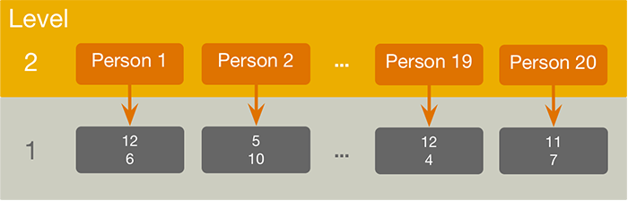
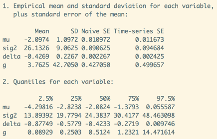

```{r setup, include=FALSE}
library(forcats)
library(learnr)
library(tidyverse)
library(BayesFactor)
library(nlme)
library(WRS2)

knitr::opts_chunk$set(echo = FALSE, warning = FALSE)
tutorial_options(exercise.cap = "Exercise")

hint_text <- function(text, text_color = "#E69F00"){
  hint <- paste("<font color='", text_color, "'>", text, "</font>", sep = "")
  return(hint)
}

#Read dat files needed for the tutorial

calcite_tib <- adventr::calcite_dat

#setup objects for code blocks

calcite_tidy <- calcite_tib %>% gather(key = "face_type", value = "recognition", -id)

```

# An Adventure in R: Repeated-measures designs (part 1)

## Overview

This tutorial is one of a series that accompanies [An Adventure in Statistics](https://www.discoveringstatistics.com/books/an-adventure-in-statistics/) [@RN10163] by me, [Andy Field](https://en.wikipedia.org/wiki/Andy_Field_(academic)). These tutorials contain abridged sections from the book so there are some copyright considerations but I offer them under a [Creative Commons Attribution-NonCommercial-NoDerivatives 4.0 International License](http://creativecommons.org/licenses/by-nc-nd/4.0/), ^[Basically you can use this tutorial for teaching and non-profit activities but do not meddle with it or claim it as your own work.]

* Who is the tutorial aimed at?
    - Anyone teaching from or reading [An Adventure in Statistics](https://www.discoveringstatistics.com/books/an-adventure-in-statistics/)  may find them useful.
* What is covered?
    - This tutorial looks at how to fit a linear model with a predictor variable that represents two dependent categories. We look at robust variants of the model, and computing a Bayes factor. It would be a useful tutorial to run alongside teaching based on Chapter 15 of [An Adventure in Statistics](https://www.discoveringstatistics.com/books/an-adventure-in-statistics/).
    - This tutorial *does not* teach the background theory: it is assumed you have either attended my lecture or read the relevant chapter in the aforementioned books (or someone else's)
    - The aim of this tutorial is to augment the theory that you already know by guiding you through fitting linear models using **R** and **RStudio** and asking you questions to test your knowledge along the way.
    

## Story précis

### Why a précis?

Because these tutorials accompany my book *An adventure in statistics*, which uses a fictional narrative to teach the statistics, some of the examples might not make sense unless you know something about the story. For those of you who don't have the book I begin each tutorial with a précis of the story. If you're not interested then fair enough - click past this section.

### General context for the story

It is the future. Zach, a rock musician and Alice, a geneticist, who have been together since high school live together in Elpis, the ‘City of Hope’.

Zach and Alice were born in the wake of the Reality Revolution which occurred after a Professor Milton Gray invented the Reality Prism – a transparent pyramid worn on the head – that brought honesty to the world. Propaganda and media spin became unsustainable, religions collapsed, advertising failed. Society could no longer be lied to. Everyone could know the truth about anything that they could look at. A gift, some said, to a previously self-interested, self-obsessed society in which the collective good had been eroded. 

But also a curse. For, it soon became apparent that through this Reality Prism, people could no longer kid themselves about their own puffed-up selves as they could see what they were really like – by and large, pretty ordinary. And this caused mass depression. People lost faith in themselves. Artists abandoned their pursuits, believing they were untalented and worthless. 

Zach and Alice have never worn a Reality Prism and have no concept of their limitations. They were born after the World Governance Agency (WGA) destroyed all Reality Prisms, along with many other pre-revolution technologies, with the aim of restoring community and well-being. However, this has not been straightforward and in this post-Prism world, society has split into pretty much two factions

* The Chippers who have had WiFi-enabled chips implanted into their brains, enabling them to record and broadcast what they see and think in real time; upload memories for future generations into a newly-created memoryBank and live-stream music and films directly into their brains. 
* The Clocktarians, followers of the old pre-Prism ways who use steam punk style technologies, who have elected not to have chips in their brains, regarded by the Chippers as backward-looking stuck in a ‘clockwork, Victorian society’. 

Everyone has a star, a limitless space on which to store their digital world.

Zach and Alice are Clocktarians. Their technology consists mainly of:

* A Proteus, a device made from programmable matter that can transform shape and function simply by the owners’ wishes. Zach calls his a diePad, in the shape of a tombstone in an ironic reference to an over-reliance on technology at the expense of memory. 
* A Reality Checker, a clockwork mechanism that, at the point of critical velocity, projects an opaque human head that is linked to everything and can tell you anything. Every head has a personality and Zach’s is a handsome, laid back ‘dude’ who is like an electronic friend, who answers questions if he feels like it and often winds Zach up by giving him false information. And he often flirts with Alice.

### Main Protagonists

* Zach
    - Rock musician in band called The Reality Enigma.
    - Spellbinding performer, has huge fan-base.
    - Only people living in Elpis get to see The Reality Enigma in the flesh. Otherwise all performances are done via an oculus riff, a multisensory headset for experiencing virtual gigs.
    - Zach’s music has influenced and changed thousands of lives. 
    - Wishes he had lived pre-Revolutionary times, the turn of the 21st Century, a golden age for music when bands performed in reality at festivals.
    - Kind, gentle and self-doubting.
    - Believes science and maths are dull and uninspiring. Creates a problem between him and Alice as she thinks that because he isn’t interested in science, he isn’t interested in her. Leads to lots of misunderstandings between them. 
* Alice
    - Shy, lonely, academically-gifted – estranged from the social world until she met Zach in the college library. 
    - Serious scientist, works at the Beimeni Centre of Genetics. 
    - At 21, won the World Science Federation’s Einstein Medal for her genetics research
    - Desperately wants Zach to get over his fear of science so he can open his mind to the beauty of it.

### How Zach's adventure begins

Alice has been acting strangely, on edge for weeks, disconnected and uncommunicative, as if she is hiding something and Zach can’t get through to her. Arriving home from band practice, unusually, she already home and listening to an old album that the two of them enjoyed together, back in a simpler, less complicated time in their relationship. During an increasingly testy evening, that involves a discussion with the Head about whether or not a Proteus causes brain cancer, Alice is interrupted by an urgent call which she takes in private. She returns looking worried and is once again, distracted. She tells Zach that she has ‘a big decision to make’. Before going to bed, Zach asks her if he can help with the decision but she says he ‘already has’, thanking him for making ‘everything easier.’ He has no idea what she means and goes to sleep, uneasy.

On waking, Zach senses that something is wrong. And he is right. Alice has disappeared. Her clothes, her possessions and every photo of them together have gone. He can’t get hold of any of her family or friends as their contact information is stored on her Proteus, not on his diePad. He manages to contact the Beimeni Centre but is told that no one by the name of Alice Nightingale has ever worked there. He logs into their constellation but her star has gone.  He calls her but finds that her number never existed. She has, thinks Zach, been ‘wiped from the planet.’ He summons The Head but he can’t find her either. He tells Zach that there are three possibilities: Alice has doesn’t want to be found, someone else doesn’t want her to be found or she never existed. 

Zach calls his friend Nick, fellow band member and fan of the WGA-installed Repositories, vast underground repositories of actual film, books, art and music. Nick is a Chipper – solely for the purpose of promoting the band using memoryBank – and he puts the word out to their fans about Alice missing. 

Thinking as hard as he can, Zach recalls the lyrics of the song she’d been playing the previous evening. Maybe they are significant? It may well be a farewell message and the Head is right. In searching for clues, he comes across a ‘memory stone’ which tells him to read what’s on there. File 1 is a research paper that Zach can’t fathom. It’s written in the ‘language of science’ and the Head offers to help Zach translate it and tells him that it looks like the results of her current work were ‘gonna blow the world’. Zach resolves to do ‘something sensible’ with the report.  

Zach doesn’t want to believe that Alice has simply just left him. Rather, that someone has taken her and tried to erase her from the world. He decides to find her therapist, Dr Murali Genari and get Alice’s file. As he breaks into his office, Dr Genari comes up behind him and demands to know what he is doing. He is shaking but not with rage – with fear of Zach. Dr Genari turns out to be friendly and invites Zach to talk to him. Together they explore the possibilities of where Alice might have gone and the likelihood, rating her relationship satisfaction, that she has left him. During their discussion Zach is interrupted by a message on his diePad from someone called Milton. Zach is baffled as to who he is and how he knows that he is currently discussing reverse scoring. Out of the corner of his eye, he spots a ginger cat jumping down from the window ledge outside. The counsellor has to go but suggests that Zach and ‘his new friend Milton’ could try and work things out.

## Packages and data
### Packages

This tutorial uses the following packages:

* `BayesFactor` [@RN9444] to compute Bayes factors
* `Hmisc` [@RN11417] to compute confidence intervals
* `nlme` [@RN5102] to estimate the multilevel models
* `tidyverse` [@RN11407] for general data processing
* `WRS2` [@RN10205] to do various robust tests

These packages are automatically loaded within this tutorial. If you are working outside of this tutorial (i.e. in **RStudio**) then you need to make sure that the package has been installed by executing `install.packages("package_name")`, where *package_name* is the name of the package. If the package is already installed, then you need to reference it in your current session by executing `library(package_name)`, where *package_name* is the name of the package.

### Data

This tutorial has the data files pre-loaded so you shouldn't need to do anything to access the data from within the tutorial. However, if you want to play around with what you have learnt in this tutorial outside of the tutorial environment (i.e. in a stand-alone **RStudio** session) you will need to download the data files and then read them into your **R** session. This tutorial uses the following file:

* [ais_15_calcite.csv](http://www.discoveringstatistics.com/repository/ais_data/ais_15_calcite.csv).

You can load the file in several ways:

* Assuming that you follow the workflow recommended in the tutorial **adventr_02** (see also this [online tutorial](http://milton-the-cat.rocks/learnr/r/r_getting_started/#section-working-in-rstudio)), you can load the data into an object called `calcite_tib` by executing:
    - `calcite_tib <- readr::read_csv("../data/ais_15_calcite.csv")`
    - If you don't follow my suggested workflow, you will adjust the file location in the above command.
* Alternatively, if you have an internet connection (and my server has not exploded!) load the file direct from the URL by executing:
    - `calcite_tib <- readr::read_csv("http://www.discoveringstatistics.com/repository/ais_data/ais_15_calcite.csv")`

## Categorical predictors with repeated measures
### The model

During Zach's visit to the JIG:SAW complex he visits several research buildings. In the first, he discovers experiments being conducted related to invisibility. The second experiment he learns about involves a repeated-measures design. The researchers asked the question of whether they could manipulate the face perceived by a participant when viewing someone wearing calcite invisibility paste. Participants were all so-called Chippers, who had ID chips installed in their brains. Each participant met 40 people who had calcite paste on their face. For each of these people we took a photo of their face (the ‘actual’ face), and found a photo of a different face matched for sex and age (the ‘different’ face). The researchers could send these images to the participant’s visual cortex using their ID chip. For 20 of the encounters an image of the person’s ‘actual’ face was transmitted to the participant’s ID chip during the encounter, for the remaining 20 encounters the ‘different’ face was sent to the chip. As such the design was repeated measures (each participant experienced both the 'actual' and 'different' conditions). During each encounter the participant was shown the photos of the actual and different face and pointed to the one depicting whom they thought they were meeting. Participants scored a point for each person they correctly identified: a score of 0 would mean that they never chose the correct photo, a score of 20 would mean that they always chose the correct photo. The prediction was that the paste would lead to lower recognition when a different face (inconsistent information) was transmitted to the visual cortex than when the actual face (consistent information) was transmitted. The data are in the tibble `calcite_tib`, which has three variables:

* **id**: Participant ID
* **actual**: How many of the 20 people the participant correctly identified when a picture of the 'actual' person was transmitted to the participant's ID chip
* **different**: How many of the 20 people the participant correctly identified when a picture of a 'different' person was transmitted to the participant's ID chip

The data has a hierarchical structure because recognition scores are nested within participants (Figure 1). We, therefore, need to model the individual differences in recognition scores (random intercept) and the effect of the type of face (random slopes).



The model we're fitting is described by the following equation:

$$
\begin{aligned}
\text{recognition}_{ij} & = b_{0i} + b_{1i}\text{face type}_{ij}+ ε_{ij}\\
b_{0i} &= b_0 + u_{0i}\\
b_{1i} &= b_1 + u_{1i}
\end{aligned}
$$

Recognition scores within participants (*i*) and experimental treatments (*j*) are predicted from overall recognition scores ($b_0$) and participant's variation around it ($u_0i$), the overall effect of the type of face ($b_1$) and participant's variation around that effect ($u_{1i}$), and some error ($ε_{ij}$). In other words, it is a multilevel model with random intercepts and slopes for the effect of face type.

### Making data 'tidy'

Use the code box to inspect the `calcite_tib` tibble.

```{r inspect_tib, exercise = TRUE}
     
```

```{r inspect_tib-solution}
calcite_tib   
```

The data are organised in what is known as the *wide format*. In this format, each row represents a different entity and columns represent different scores belonging to that entity. For example, row 1 belongs to participant 1, column 2 tells us that they recognized 12 faces when a photo of the *actual* face was transmitted to their ID chip and column 3 tells us that they recognized 6 faces when a photo of a *different* face was transmitted to their ID chip. As such, the variable representing the type of face is split across two columns. The *wide format* is very common, but is *messy*, and usually we want the data to *tidy*. Although there is a lot more to it than this, pragmatically, @RN10209 distinguished *tidy* and *messy* data structures as follows:

> A dataset is messy or tidy depending on how rows, columns and tables are matched up with observations, variables and types. In tidy data:
>
> 1. Each variable forms a column.
> 2. Each observation forms a row.
> 3. Each type of observational unit forms a table.
> 
> ... Messy data is any other arrangement of the data.

To make our data 'tidy' we can use the `gather()` function from the `tidyverse` suite of packages (specifically `tidyr`). This function gathers columns together and puts them into a single column (across multiple rows). It takes the form:

`gather(data, key = "name_of_column_containing_variable_information", value = "name_of_column_containing_values")`

Basically, you enter the name of the tibble that you want to restructure. It will stack all of the values from the columns into a single column with the name that you provide in the `value` argument, and it will list the original column names in a variable with the name that you provide in the `key` argument. If you ignore the `key` and `value` arguments the function will use the names **key** and **value**. To get a feel for what happens, try executing:

`tidyr::gather(calcite_tib)`

in the code box below.

Our initial tibble had 20 rows (one for each participant) and 3 columns (**id**, **actual**, **different**). You'll see that the restructured tibble has 60 rows (3 for each participant) and 2 columns (one containing the original column names, and one containing the values associated with each participant for the three original columns).

This structure isn't helpful to us because it has gathered *all* of the original columns, and we need it to gather only the **actual** and **different** columns leaving the **id** column alone (because this column tells us to which participant a score belongs). We can tell the function to leave the **id** column alone by using a minus sign (`-id`). We should also define the `key` and `value` names. We might call the *key* variable **face_type**, because it will represent whether the face beamed to the ID chip was the actual face or a different one, and the *value* variable **recognition** because it contains recognition scores (out of 20). Putting all of this together we could execute:

`tidyr::gather(calcite_tib, key = "face_type", value = "recognition", -id)`

Try this command is the code box. The resulting tibble should have 40 rows (each of 20 participants under each of the two conditions) and three columns (**id** tells us the participant number, **face_type** defines the experimental condition, and **recognition** contains the recognition score for each participant in each experimental condition). These data are tidy. So we can use this restructured tibble we need to save it into an object. Let's call it `calcite_tidy`. We can do this using a pipe:

```
calcite_tidy <- calcite_tib %>% 
  tidyr::gather(key = "face_type", value = "recognition", -id)
```

Execute this command in the code box, and inspect the resulting tibble.


```{r gather_tib, exercise = TRUE}
     
```

```{r gather_tib-solution}
calcite_tidy <- calcite_tib %>%
  tidyr::gather(key = "face_type", value = "recognition", -id)

calcite_tidy
```

### Descriptive data

Use what you've learnt in previous tutorials to create a tibble called `calcite_summary` containing the mean recognition scores (and their confidence intervals) in the two experimental conditions.

`r hint_text("Tip: Remember to use the tidy tibble that we've just created. If you're doing this outside of the tutorial remember to load the packages tidyverse and Hmisc")`

```{r desc, exercise = TRUE, exercise.lines = 6}
             
```

```{r desc-solution}
calcite_summary <- calcite_tidy %>%
  dplyr::group_by(face_type) %>%
  dplyr::summarize(
    mean_recognition = mean(recognition),
    ci_low_recognition = ggplot2::mean_cl_normal(recognition)$ymin,
    ci_upp_recognition = ggplot2::mean_cl_normal(recognition)$ymax
)
calcite_summary              
```


### Plotting the data

Use the code box below to create an error bar chart with **face_type** on the *x*-axis and **recognition** on the *y*-axis. If you feel like it, try to superimpose the raw data. (If you do this last part you'll use the `geom_point()` function, try this, but then add into the function `position = position_jitter(width = 0.1, height = 0)`. This adds what's known as a 'jitter' to the points, which just means that small a random value is added so that the dots don't overlap. By setting width to 0.1, we're limiting the horizontal jitter and disabling the horizontal jitter so that the values on the *y*-axis are true to the actual scores.) Remember to use the 'tidy' version of the data.

```{r scat, exercise = TRUE, exercise.lines = 8}
     
               
```

```{r scat-solution}
calcite_plot <- ggplot2::ggplot(calcite_tidy, aes(face_type, recognition))
calcite_plot +
  geom_point(colour = "#E69F00", position = position_jitter(width = 0.1, height = 0)) +
  stat_summary(fun.data = "mean_cl_normal", geom = "pointrange") +
  labs(x = "Experimental condition", y = "Recoognition (out of 20") +
  coord_cartesian(ylim = c(0, 20)) +
  scale_y_continuous(breaks = 0:20) +
  scale_x_discrete(labels = c("Actual face", "Different face")) + #adds more descriptive labels to the x-axis
  theme_bw()
```


## Fitting the model

It looks like recognition scores are lower in the *different* condition. To fit the model we use the `lme()` function from the `nlme` package, because we are fitting a linear model with a categorical predictor, but we want to also model the dependency between scores. This function is explained in the tutorial **adventr_mlm**, just to recap it takes the following general form (I've retained only the key options):

`new_object <- lme(outcome ~ predictors, random = formula, data = tibble, method = "REML", na.action = na.fail)`

* `new_model`: an object created that contains information about the model. We can get summary statistics for this model by executing the name of the model.
* `outcome`: the variable that contains the scores for the outcome measure (in this case **recognition**).
* `predictor`: the variable that contains information about to which condition a score belongs (in this case **face_type**).
* `random`: defines the random parts of the model. This takes a formula in the style `~ predictor|context`. In this case our context is participants, which is represented by the variable **id**. If we want only to let intercepts vary by participant we could use `~ 1|id`, but in fact we also want to let the effect of **face_type** vary by participant so we'd use `~ face_type|id`.
* `tibble`: the name of the tibble containing the data (in this case `calcite_tidy`).
* `method`: defines which estimation method is used. By default restricted maximum likelihood is used (REML), but if you want to compare models you should override the default and use maximum likelihood (`method = "ML"`).
* `na.action`: If you have complete data (as we have here) exclude this option, but if you have missing values (i.e., ‘NA’s in the data frame) then by default the model will fail, so include `na.action = na.exclude` to exclude cases with missing values.

We could, therefore, specify the model as:

```{r echo = TRUE, eval = FALSE}
calcite_rs <- nlme::lme(recognition ~ face_type, random = ~ face_type|id, data = calcite_tidy, method = "ML")
summary(calcite_rs)
intervals(calcite_rs, which = "fixed")
```

The first line creates an object called `calcite_rs` which predicts recognition scores from the effect of **face_type** but with intercepts and slopes allowed to vary across participants (I appended `_rs` to the name to remind me it is a *r*andom *s*lopes model). The `summary()` function gives me a summary of the model (including a *t*-statistic and *p*-value for the fixed effect of **face_type**) and `intervals()` gives me 95% confidence intervals for the fixed effects (hence the `which = "fixed"`), which in this case are the intercept and effect of **face_type**.

Try executing these commands in the code box.

```{r lme_1, exercise = TRUE}
     
               
```

```{r lme_1-solution}
calcite_rs <- nlme::lme(recognition ~ face_type, random = ~ face_type|id, data = calcite_tidy, method = "ML")
summary(calcite_rs)
intervals(calcite_rs, which = "fixed")
```

The output provides estimates of the model parameters (the *b*-values) and the significance of these values. The *Y* intercept ($b_0$) is 9.20, which is the value of recognition when **face_type** = 0. **R** will have coded the variable **face_type** using dummy coding. It will do this alphabetically (unless you tell it something different), which means that it will have coded 'actual' as 0 and 'different' as 1 (because *a* comes before *d* in the alphabet). Note that 9.20 is the value of the mean in the *actual* condition that we calculated earlier.

```{r quiz_b_ex1}
quiz(
  question("How would we interpret the *Value* (-2.35) for *face_typedifferent*? [Select **two** correct answers.]",
    answer("As the value of **face_type** changed from 0 (actual) to 1 (different), recognition scores decrease by 2.35.", correct = T),
    answer("The difference between group means is -2.35.", correct = T),
    answer("As the value of **face_type** changed from 0 (actual) to 1 (different), recognition scores decrease by 2.35 of a standard deviation", message = "This describes the *standardized* B, not the *unstandardized*."),
    answer("Group membership explains -2.35% of the variance in recognition scores", message = sprintf("This is what $R^2$ tells us and you can't have a negative percentage of variance explained!")),
    correct = "Correct - well done!",
    random_answer_order = TRUE,
    allow_retry = T
  )
)
```

The confidence interval for the effect of **face_type** tells us that (assuming that this is one of the 95% of samples that yields a confidence interval containing the population value) the true difference between recognition scores when a picture of the actual person's face was used compared to a different face lies between -4.596 and -0.104. This means it could be anything between a very small effect (practically zero) to a fairly large one (4 to 5 fewer faces recognised). The *p*-value suggests that this difference is significant at *p* = 0.046. In other words, we can significantly predict recognition scores from the type of face implanted while the participant met people with calcite paste on their face.

### A more traditional approach

We have just used a hierarchical linear model to compare two means using a *t*-statistic. You have likely been taught about *t*-tests as tests in their own right, and also taught that to compare dependent means you should use the paired (dependent) *t*-test. You can do the paired *t*-test in *R* using the `t.test()` function described in **adventr_15**:
 
 `new_model <- t.test(outcome ~ predictor, data = tibble, paired = FALSE, var.equal = FALSE, conf.level = 0.95, na.action)`

In which:

* `new_model`: an object created that contains information about the model. We can get summary statistics for this model by executing the name of the model.
* `outcome`: the variable that contains the scores for the outcome measure (in this case **recognition**).
* `predictor`: the variable that contains information about to which group a score belongs (in this case **face_type**).
* `tibble`: the name of the tibble containing the data (in this case `calcite_tidy`) 
* `paired`: by default scores are treated as independent (`paired = FALSE`), but in this case we want to treat scores as dependent so we'd change this to `paired = TRUE`
* `conf.level`: determines the alpha level for the *p*-value and confidence intervals. By default it is 0.95 (for 95% confidence intervals) and usually you’d exclude this option, but if you want to use a different value, say 99%, you could include `conf.level = 0.99`.
* `na.action`: If you have complete data (as we have here) exclude this option, but if you have missing values (i.e., ‘NA’s in the data frame) then it can be useful to include `na.action = na.exclude`, which will exclude all cases with missing values

To get a *t*-test for the current data we would execute:

```{r echo = T, eval = F}
t.test(recognition ~ face_type, data = calcite_tidy, paired = TRUE)
```

or to create an object that we can use later:

```{r, echo = T, eval = F}
calcite_t <- t.test(recognition ~ face_type, data = calcite_tidy, paired = TRUE)
calcite_t
```

Try this in the code box:

```{r t1, exercise = TRUE}

```

```{r t1-solution}
calcite_t <- t.test(recognition ~ face_type, data = calcite_tidy, paired = TRUE)
calcite_t
```

The value of *t* (2.1346) and the corresponding *p* (0.04604) are identical to the linear model that we have already fitted. However, for more complicated designs the linear model has many benefits.

## Robust models

The `WRS2` package [@RN10205] wraps up a few of the many functions described by Wilcox to perform robust variants of tests [@RN5244]. We'll look at one function that compare two dependent means:

`yuend(x, y, tr = 0.2)`

The arguments are:

* `x`: scores in the first condition.
* `y`: scores in the first condition.
* `tr = 0.2`: determines the level of trim. The default is a 20% trim, which has been shown to perform well, but you could change this to 0.1 (10% trim) or any value up to 0.5. You can omit this argument if you're happy with a 20% trim.

To specify *x* and *y* we need to extract them from our tibble. (I will describe one approach that is consistent with using *tidy* data, but there are others.) We would start by creating separate objects for the scores in the *actual* and *different* conditions, using `select()` and `filter()`, then insert these into the `yuend()` function:

```{r echo = TRUE, eval = FALSE}
actual <- calcite_tidy %>%
  dplyr::filter(face_type == "actual") %>%
  dplyr::select(recognition)

different <- calcite_tidy %>%
  dplyr::filter(face_type == "different") %>%
  dplyr::select(recognition)

WRS2::yuend(different, actual, tr = 0.2)
```

The first line takes the `calcite_tidy` tibble and filters it to retain only the scores relating to when the variable **face_type** has a value equal to "actual", it then selects the variable **recognition**, which contains the recognition scores. This pipe basically extracts the 20 recognition scores from the *actual* condition and stores them in a tibble called **actual**. The second command does the same but extracts the 20 recognition scores from the *different* condition and stores them in a tibble called **different**. The third lines applies the `yuend()` to the two tibbles we have just created. (You can exclude `tr = 0.2` because it is the default but I have left it there to make explicit that we are performing a 20% trim.)

Execute these commands in the code box (if stuck, click )

```{r calcite_wrs, exercise = TRUE}

```

```{r calcite_wrs-solution}
actual <- calcite_tidy %>%
  dplyr::filter(face_type == "actual") %>%
  dplyr::select(recognition)

different <- calcite_tidy %>%
  dplyr::filter(face_type == "different") %>%
  dplyr::select(recognition)

WRS2::yuend(different, actual, tr = 0.2)
```

Note that the trimmed mean difference is -2.75 (rather than the raw mean difference of -2.35). This difference is not significant because *p* = 0.087 and the confidence intervals cross zero, indicating that if this is one of the 95% of samples where the confidence interval contains the population value, then the population difference between means could be positive, negative or zero.

The effect size is a robust variant of Cohen's *d* so can be interpreted as implanting a different face producing recognition scores 0.52 of a standard deviation below that for the actual face.

## Bayesian models
### Bayes factors

Like in **adventr_15** we can use the `ttestBF()` function from the [BayesFactor package](http://bayesfactorpcl.r-forge.r-project.org/). This function was explained in **adventr_15**, but with repeated measures data we can't use formula input:

`object = ttestBF(x, y, data = tibble, paired = FALSE, rscale = "medium")`

To recap, by default the function assumes independent scores (`paired = FALSE`) so for dependent scores we'd change this to `paired = TRUE`. The function uses default priors that can be specified as a number or as "medium" (the default), "wide", and "ultrawide". These labels correspond to *r* scale values of $^\sqrt{2}/_2$, 1, and $\sqrt{2}$. These priors were explained in **adventr_11**.

To specify *x* and *y* we can use the **actual** and **different** objects that we created for the `yuend()` function. The `ttextBF()` is expecting only scores, not a tibble or data frame and the objects **actual** and **different** are tibbles. In both objects the scores are stored in a variable called **recognition** so we can specify the scores as `different$recognition` and `actual$recognition`. (Remember that `$` means 'in', so `different$recognition` translates as 'the variable called *recognition* in the tibble called *different*'. 

It's a good idea to save this model into a new object (lets call it `calcite_bf`) because you can do useful things with it (we didn't do this for the `yuend()` functions, but you could). For our data (using the default prior) we could execute:

```{r echo = T, eval = F}
calcite_bf <- BayesFactor::ttestBF(different$recognition, actual$recognition, paired = TRUE)
calcite_bf
```

The first line creates the object `calcite_bf` as described above and the second line prints it for us to see. Try this in the code box:

```{r calcite_bf-setup}
actual <- calcite_tidy %>%
  dplyr::filter(face_type == "actual") %>%
  dplyr::select(recognition)

different <- calcite_tidy %>%
  dplyr::filter(face_type == "different") %>%
  dplyr::select(recognition)
```

```{r calcite_bf, exercise = TRUE}
  
```

```{r calcite_bf-solution}
calcite_bf <- BayesFactor::ttestBF(different$recognition, actual$recognition, paired = TRUE)
calcite_bf
```

The value matches that in the book (*an adventure in statistics*). The Bayes factor is 1.48, which means that the probability of the data given the alternative hypothesis is 1.48 times greater than the probability of the data given the null hypothesis. Put another way, you should shift your belief in the alternative hypothesis relative to the null by a factor of 1.48 (i.e. not by much at all). The result favours the alternative hypothesis over the null by an amount that is ‘barely worth mentioning’.

### Bayesian parameter estimates

We can get estimate of the parameters in the model using the `posterior()` function that we used in **adventr_15** to extract the same information. The process is identical to what we did in that previous tutorial. We place the object we just created (`calcite_bf`) into the function and specify a number of iterations, then use the `summary()` function to view what we have created:

```{r echo = T, eval = F}
calcite_bf_est <- BayesFactor::posterior(calcite_bf, iterations = 10000)
summary(calcite_bf_est)
```

Try executing these two commands to view the estimates:

```{r calcite_bf_est-setup}
actual <- calcite_tidy %>%
  dplyr::filter(face_type == "actual") %>%
  dplyr::select(recognition)

different <- calcite_tidy %>%
  dplyr::filter(face_type == "different") %>%
  dplyr::select(recognition)

calcite_bf <- BayesFactor::ttestBF(different$recognition, actual$recognition, paired = TRUE)
```

```{r calcite_bf_est, exercise = TRUE}
  
```

```{r calcite_bf_est-solution}
calcite_bf_est <- BayesFactor::posterior(calcite_bf, iterations = 10000)
summary(calcite_bf_est)
```

The output will differ each time you run this (because it is based on a sampling process) so Figure 2 shows my output. The Bayesian estimate, assuming that the alternative hypothesis is true, of the difference between means (mu) is -2.09. You can use the 2.5% and 97.5% quantiles as the limits of the 95% credible interval for that difference. Again, assuming the alternative hypothesis is true, there is a 95% probability that the difference between means is somewhere between -4.298 and 0.056. Remember that you cannot use a credible interval to test hypotheses because it is constructed assuming that the alternative hypothesis is true. It tells you the interval within which the effect will fall with a 95% probability, assuming that the effect exists.




## Other resources

### Statistics

* The tutorials typically follow examples described in detail in @RN10163, so for most of them there's a thorough account in there. You might also find @RN4832 useful for the **R** stuff.
* There are free lectures and screen casts on my [YouTube channel](https://www.youtube.com/user/ProfAndyField/)
* There are free statistical resources on my website [www.discoveringstatistics.com](http://www.discoveringstatistics.com)

### R

* Information on using [ggplot2](http://ggplot2.tidyverse.org/) 
* [R for data science](http://r4ds.had.co.nz/index.html) is the open-access version of the book by tidyverse creator Hadley Wickham [@RN11404]. It covers the *tidyverse* and data management.
* [ModernDive](http://moderndive.com/index.html) is an open-access textbook on **R** and **RStudio**
* [RStudio cheat sheets](https://www.rstudio.com/resources/cheatsheets/)
* [RStudio list of online resources](https://www.rstudio.com/online-learning/)
* [SwirlStats](http://swirlstats.com/students.html) is a package for *R* that launches a bunch of interactive tutorials.

## References
